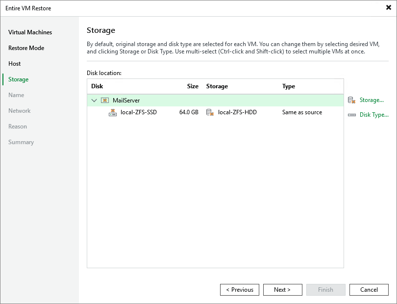

# Step 5. Select Storage

[This step applies only if you have selected the Restore to a new location, or with different settings option at the Restore Mode step of the wizard]

At the Storage step of the wizard, choose storage where virtual disks of the recovered VM will be stored. For storage to be displayed in the list of available storage, it must be configured in the virtual environment as described in [Proxmox VE documentation](https://pve.proxmox.com/wiki/Storage).

If you restore the VM to the original host, Veeam Backup & Replication will automatically select the same storage where the original VM disks were stored at the moment of backup. If you restore the VM to a new host, you will have to select storage manually. In both cases, the restored disks will by default have the same type as the original VM disks; however, you can specify another type manually.

|  |
| --- |
| NoteS |
| * You will not be able to select storage and disk type for each VM disk separately. * If the selected storage does not support the specified disk type, Veeam Backup & Replication will display a warning notifying that some of the provided settings are invalid. You will still be able to proceed with the wizard without changing the disk type; in this case, Veeam Backup & Replication will automatically choose a supported disk type while restoring the VM. |

