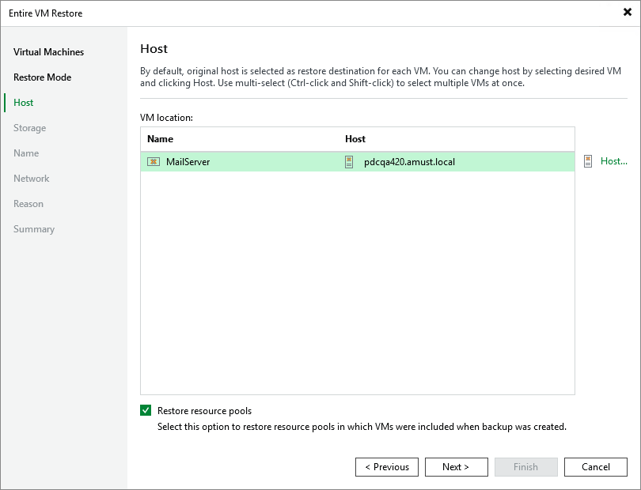

# Step 4. Specify Target Host

[This step applies only if you have selected the Restore to a new location, or with different settings option at the Restore Mode step of the wizard]

At the Host step of the wizard, choose a host to which the recovered VM will belong. For a host to be displayed in the list of available hosts, it must be added to the backup infrastructure as described in section [Connecting Proxmox VE Server](pve_connecting_manager.md).

|  |
| --- |
| Tip |
| You can also choose whether you want the recovered VM to be included into the same resource pool as the original VM. |

