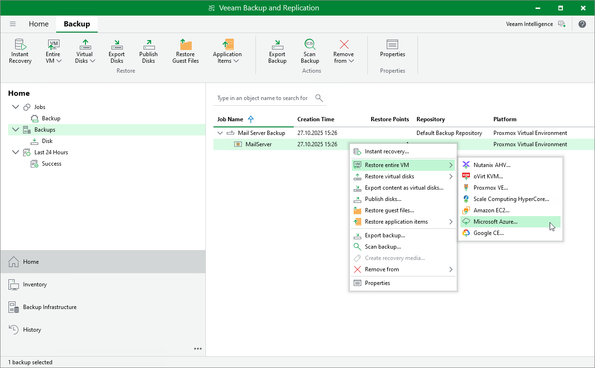

# Performing VM Restore to Microsoft Azure

Veeam Backup & Replication allows you to restore VMs to Microsoft Azure as Azure VMs. For more information, see [Restore to Microsoft Azure](restore_azure.md).

To restore a VM to Microsoft Azure, do the following:

1. Open the Home view.
2. In the inventory pane, select Backups.
3. In the working area, expand the necessary backup job, right-click the VM that you want to restore and select Microsoft Azure.

Alternatively, expand the necessary backup job, select the VM and click Entire VM > Microsoft Azure on the ribbon.

1. Complete the Restore to Microsoft Azure wizard as described in section [Restoring to Microsoft Azure](restore_azure_process.md).

