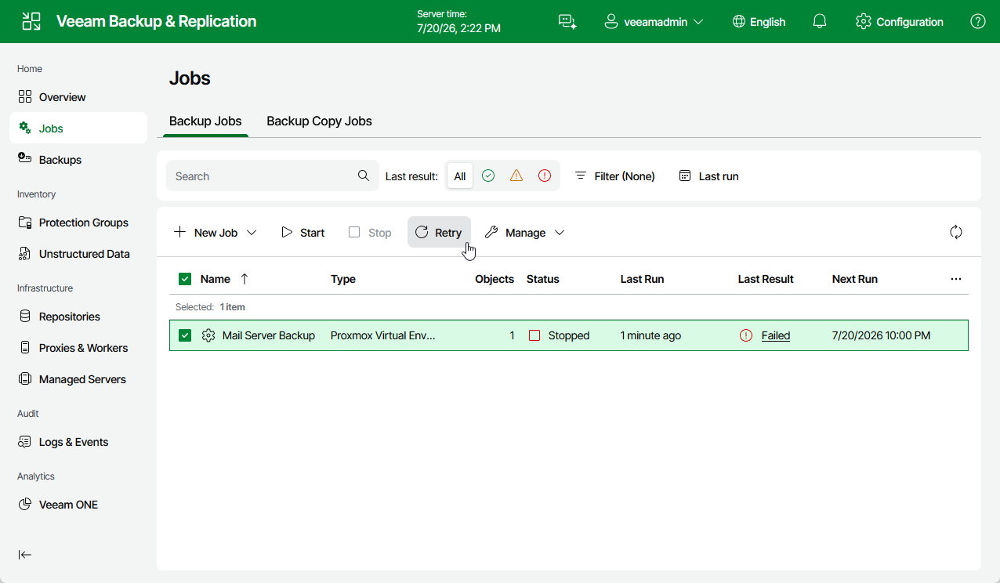

# Retrying Jobs

If a job fails, you can retry the backup operation. When you perform a retry, Veeam Backup & Replication restarts the operation only for the failed resources added to the job and does not process VMs that have been processed successfully. As a result, retrying a job takes less time compared to restarting the job for all resources.

To retry a job, do the following:

1. Navigate to Jobs.
2. Select the failed job.
3. Click Retry.

Page updated 2026-07-27

