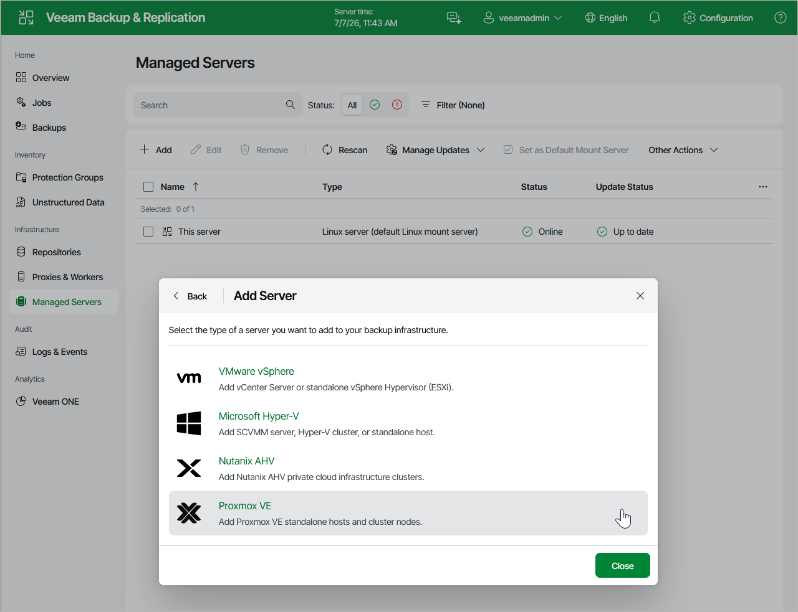

# Step 1. Launch New Proxmox VE Server Wizard

To launch the New Proxmox VE Server wizard, do the following:

1. Navigate to Managed Servers and click Add.
2. Select Virtualization Platforms > Proxmox VE.

Page updated 2026-07-01

