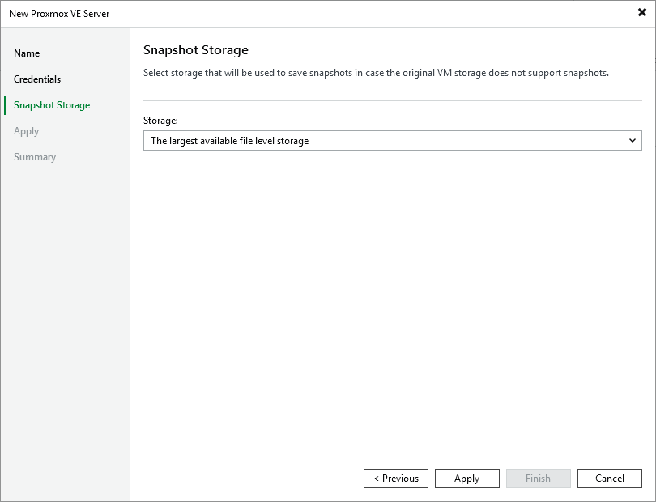

# Step 4. Configure Storage Settings

At the Snapshot Storage step of the wizard, choose whether you want to keep snapshots of processed VMs in specific file-level storage or in the largest file-level storage available on the connected Proxmox VE server — but only in case the original VM storage does not support snapshots.

|  |
| --- |
| Note |
| Keep in mind that you cannot choose block storage — only file-level storage can be selected. For more information on file-level storage, see [Proxmox VE documentation](https://pve.proxmox.com/wiki/Storage). |

