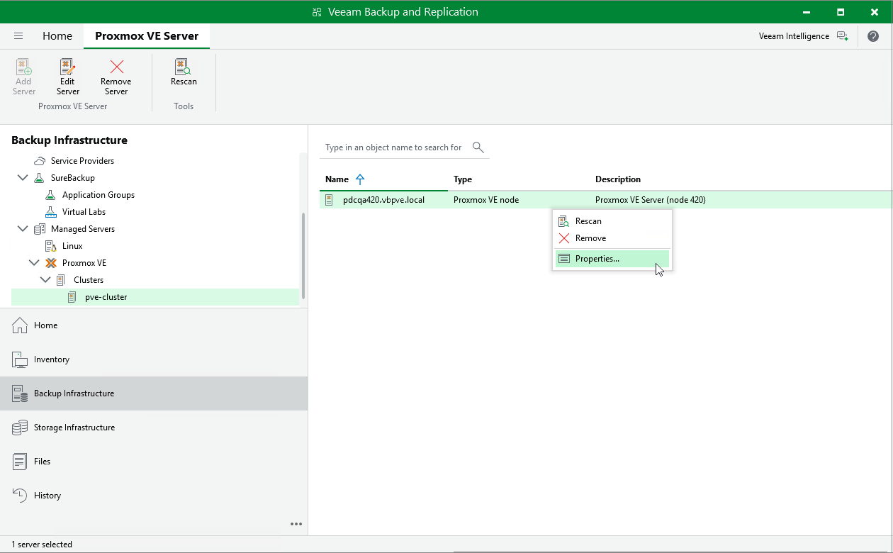

# Editing Proxmox VE Server Properties

To edit properties of the Proxmox VE server added to the backup infrastructure, do the following:

1. Open the Backup Infrastructure view.
2. In the inventory pane, select Managed Servers > Proxmox VE > Clusters > pve-cluster.
3. In the working area, select the Proxmox VE server and click Edit Server on the ribbon, or right-click the Proxmox VE server and select Properties.
4. Complete the Edit Proxmox VE Server wizard as described in section [Adding Proxmox VE server to Backup Infrastructure](pve_sever_add.md).

