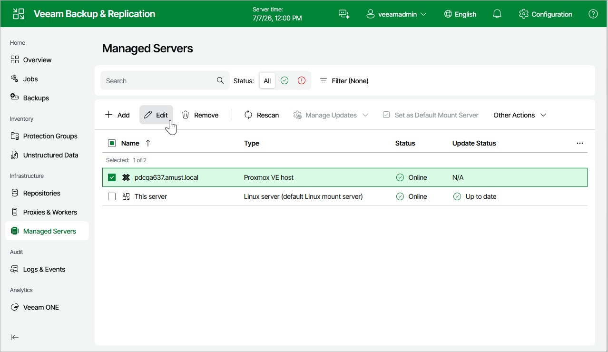

# Editing Proxmox VE Server Properties

To edit properties of the Proxmox VE server added to the backup infrastructure, do the following:

1. Navigate to Managed Servers.
2. Select the necessary Proxmox VE server and click Edit on the menu, or right-click the Proxmox VE server and select Edit.
3. Complete the Edit Proxmox VE Server wizard as described in section [Adding Proxmox VE server to Backup Infrastructure](pve_server_add_web.md).

Page updated 2026-07-01

