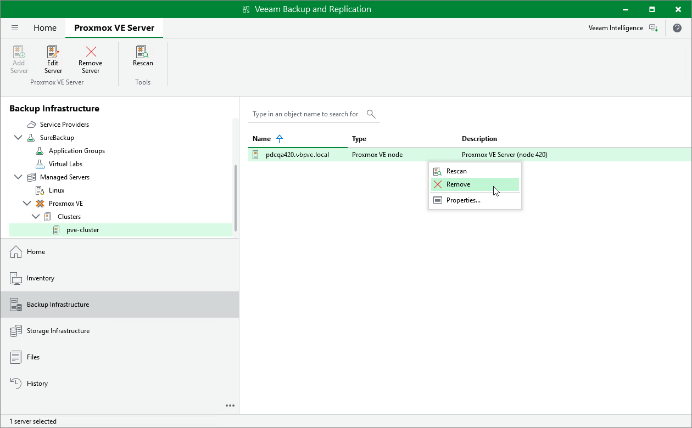

# Removing Proxmox VE Server

If you do not want to protect resources managed by the connected Proxmox VE server anymore, you can remove it from the backup infrastructure.

To remove the Proxmox VE server from the backup infrastructure:

1. Open the Backup Infrastructure view.
2. In the inventory pane, select Managed Servers > Proxmox VE > Clusters > pve-cluster.
3. In the working area, select the Proxmox VE server and click Remove Server on the ribbon, or right-click the Proxmox VE server and select Remove.

