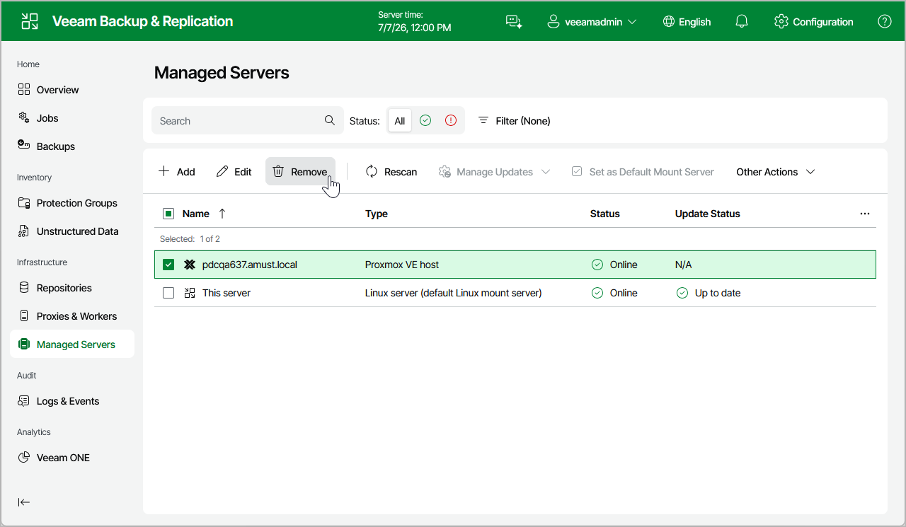

# Removing Proxmox VE Server

If you do not want to protect resources managed by the connected Proxmox VE server anymore, you can remove it from the backup infrastructure.

To remove the Proxmox VE server from the backup infrastructure:

1. Navigate to Managed Servers.
2. Select the necessary Proxmox VE server and click Remove on the menu, or right-click the Proxmox VE server and select Remove.

Page updated 2026-07-01

