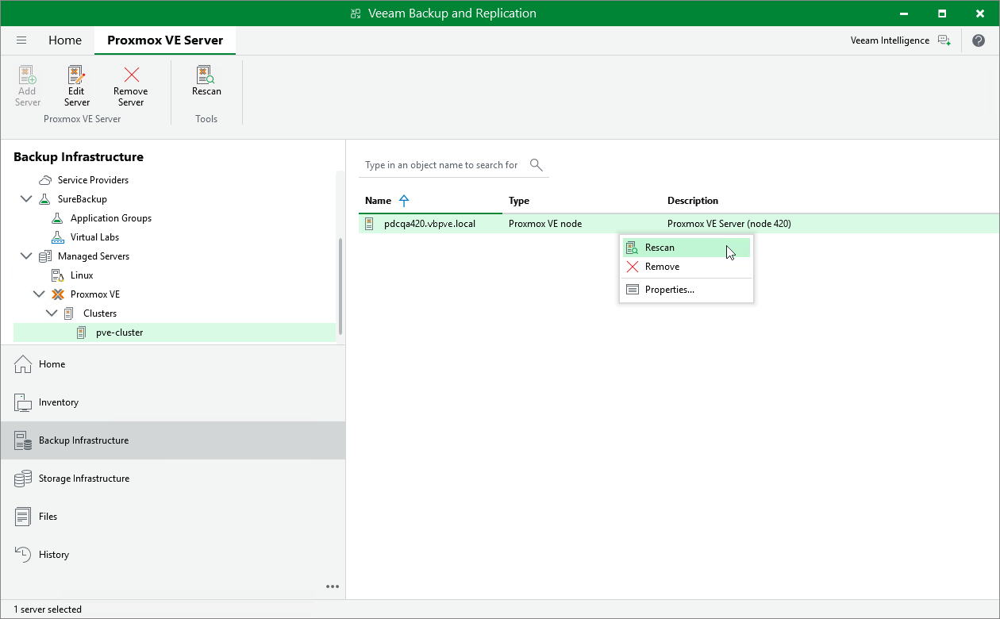

# Rescanning Proxmox VE Server

Veeam Backup & Replication retrieves information about the Proxmox VE environment from the Proxmox VE server. However, the data synchronization process may take some time to complete. If you make any changes to the Proxmox VE environment and want the Veeam Backup & Replication console to display the changes immediately, you can rescan the Proxmox VE server manually.

To rescan the Proxmox VE server, do the following:

1. Open the Backup Infrastructure view.
2. In the inventory pane, select Managed Servers > Proxmox VE > Clusters > pve-cluster.
3. In the working area, select the Proxmox VE server and click Rescan on the ribbon, or right-click the Proxmox VE server and select Rescan.

