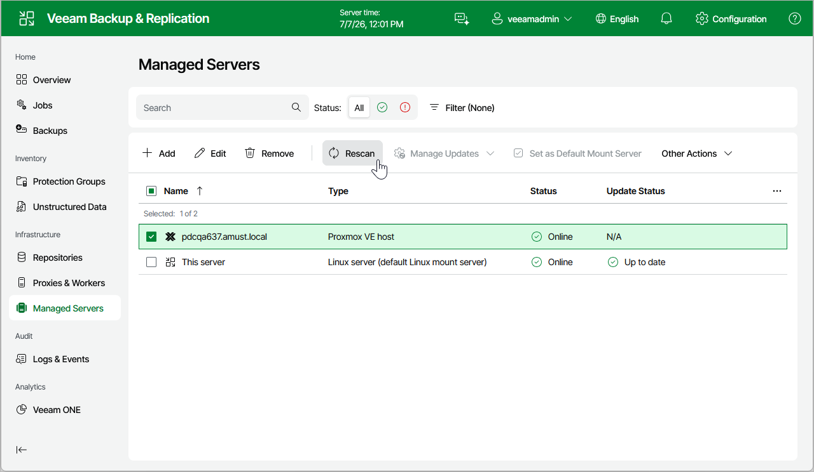

# Rescanning Proxmox VE Server

Veeam Backup & Replication retrieves information about the Proxmox VE resources from the Proxmox VE server. However, the data synchronization process may take some time to complete. If you make any changes to the Proxmox VE environment and want the Veeam Backup & Replication web UI to display the changes immediately, you can rescan the Proxmox VE server manually.

To rescan the Proxmox VE server, do the following:

1. Navigate to Managed Servers.
2. Select the necessary Proxmox VE server and click Rescan on the menu, or right-click the Proxmox VE server and select Rescan.

|  |
| --- |
| Tip |
| You can track the progress of the rescan session on the Logs and Events page. To check the session details, switch to the Session Logs tab and open the Status window as described in section [Viewing History Statistics](history_statistics.md). |

Page updated 2026-07-01

