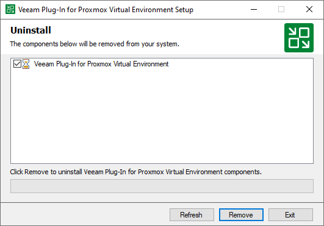

# Uninstalling Veeam Plug-In for Proxmox VE Manually

Before you uninstall Veeam Plug-in for Proxmox VE, it is recommended to [remove all configured workers](pve_workers_remove.md) from the backup infrastructure.

To uninstall Veeam Plug-in for Proxmox VE, do the following:

1. Log in to the backup server using an account with the Local Administrator permissions.
2. Open the Start menu and click the Settings icon.
3. In the Settings window, navigate to System > Apps and Features.
4. In the program list, select  Veeam Plug-in for Proxmox Virtual Environment. Then, click Uninstall.
5. In the opened window, click Remove.

Related Topics

* [Removing Proxmox VE Server](pve_server_remove.md)
* [Removing Workers](pve_workers_remove.md)

