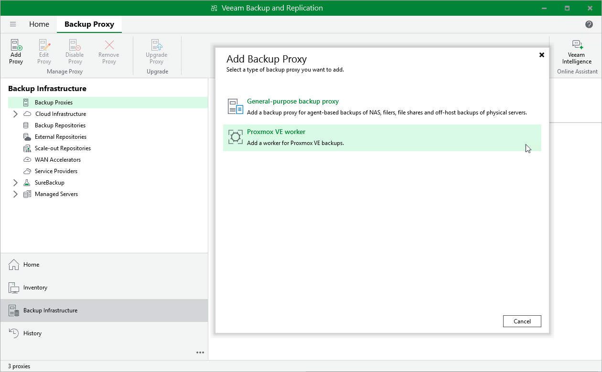

# Step 1. Launch New Proxmox Worker

To launch the New Proxmox VE Worker wizard, do the following:

1. In the Veeam Backup & Replication console, open the Backup Infrastructure view.
2. In the inventory pane, select Backup Proxies.
3. On the ribbon, select Add Proxy.

1. Click Proxmox VE worker.

