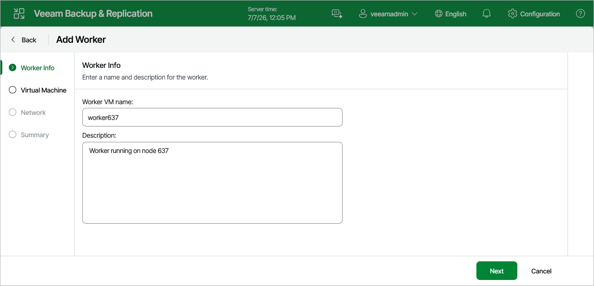

# Step 2. Specify Worker Name and Description

At the Worker Info step of the wizard, use the Name and Description fields to specify a name for the worker and to provide a description for future reference. The worker name must be unique in Veeam Plug-in for Proxmox VE.

The maximum length of the name is 40 characters; only the following characters are supported: a-z, A-Z, 0-9, -. The maximum length of the description is 1024 characters.

Page updated 2026-07-14

