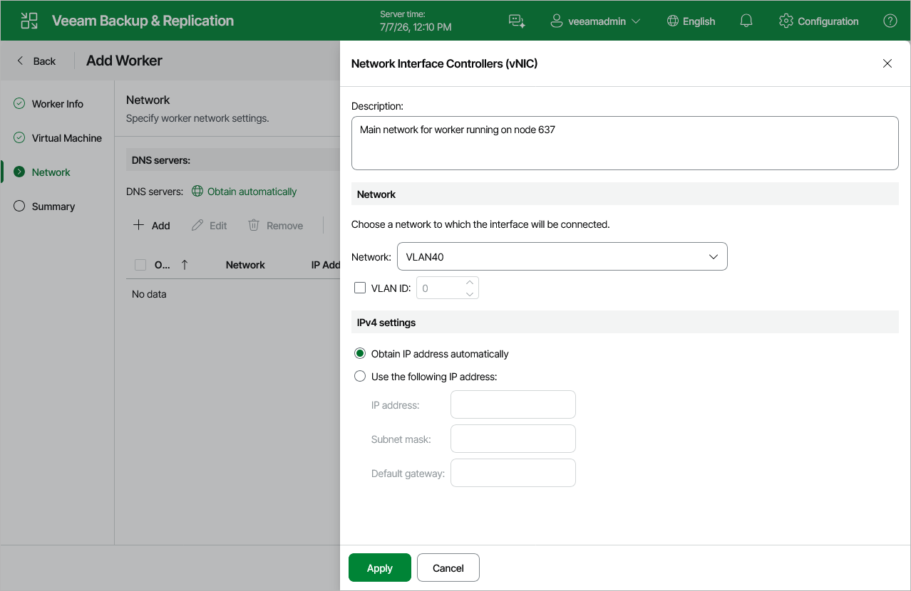

# Step 4. Configure Network Settings

At the Network step of the wizard choose a network to which the worker VM will be connected. To do that, click Add and do the following to configure a worker network interface:

1. In the Description field, provide a network interface description for future reference.
2. From the Network drop-down list, select a network to which the worker network interface will be connected.

For a network to be displayed in the list of available networks, it must be configured in the virtual environment as described in [Proxmox VE documentation](https://pve.proxmox.com/wiki/Network_Configuration).

1. If VLAN tagging is enabled in the selected network, specify the VLAN ID for the worker VM network interface.
2. If DHCP is enabled in the selected network, the IP address of the worker can be obtained automatically.

If DHCP is disabled in the selected network, or you want to configure DNS settings manually, click the link in the DNS servers field, select the Use the following DNS server address option and enter the IP addresses of the preferred and alternate DNS servers. Keep in mind that DNS settings cannot be configured separately for each network added to the worker.

|  |
| --- |
| Tip |
| If you want to use a specific network to transfer backed-up data from and to backup repositories, you can configure multiple network interfaces for the worker VM and connect them to different networks. Since workers deployed by Veeam Plug-in for Proxmox VE are Linux-based VMs, they have the same limitations that apply to machines running the Rocky Linux operating system:   * The network priority must be considered while configuring multiple networks. You can specify the network order using the Up and Down buttons to follow the recommendations described in section [Configuring Multiple Networks](pve_multiple_networks.md). * DNS settings cannot be configured separately for each network added to the worker. |

Configuring Internet Proxy for Updates

To check for available package updates for the worker, Veeam Backup & Replication automatically connects to Veeam repositories over the internet. If the worker is not connected to the internet, Veeam Backup & Replication uses [backup server update settings](update_appliance_configure_updates.md) to obtain the configuration of an internet proxy that provides access to the necessary repositories. However, you can enter specific internet proxy settings that will be used for the current worker. To do that, click Advanced and do the following in the Advanced Settings window:

1. From the Internet proxy settings drop-down list, select Use custom settings.
2. In the Host field, enter a DNS name or an IPv4 address of the internet proxy.
3. In the Port field, enter the port used on the internet proxy for HTTP or HTTPS connections.
4. If your internet proxy requires authentication, select the Use authentication check box, and select credentials of the account configured on the proxy to access the internet.

For credentials to be displayed in the Credentials list, they must be added to the Credentials Manager as described in section [Standard Accounts](credentials_manager_windows.md). If you have not added the necessary credentials to the Credentials Manager beforehand, you can do this without closing the wizard.

|  |
| --- |
| Tip |
| If the worker does not have access to the internet and no internet proxy is configured for the worker, you can instruct Veeam Backup & Replication not to update it. To do that, clear the Check for updates online check box. |

Page updated 2026-07-28

