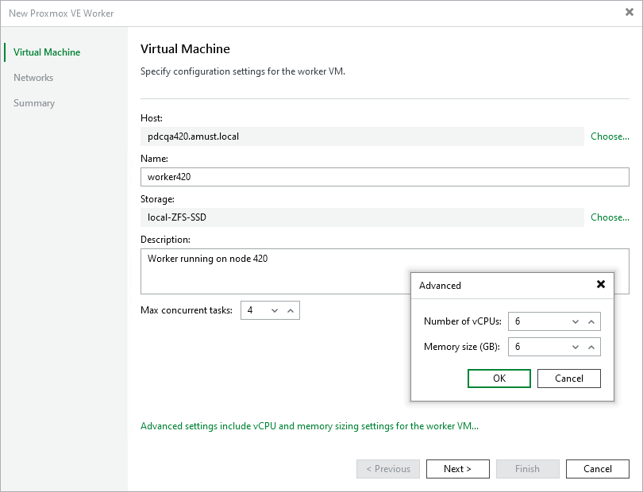

# Step 2. Specify Worker VM Settings

At the Virtual Machine step of the wizard, do the following:

1. Click Choose next to the Host field to specify a host where the worker will be launched.

Make sure that the default local storage is enabled on the selected host. If you cannot use the default storage in your environment, contact [Veeam Customer Support](pve_export_logs.md).

1. In the Name field, specify a name for the worker. The maximum length of the name is 40 characters; the following characters are only supported: a-z, A-Z, 0-9, -.
2. Click Choose next to the Storage field to select storage where system files of the worker will be stored. For storage to be displayed in the list of available storage, it must be configured in the virtual environment as described in [Proxmox VE documentation](https://pve.proxmox.com/wiki/Storage).

Make sure that the selected storage supports snapshots.

1. In the Worker description field, provide a description for future reference. The maximum length of the description is 1024 characters.
2. In the Max concurrent tasks field, specify the number of tasks that the worker will be able to handle in parallel. If this value is exceeded, the worker will not start processing a new task until one of the currently running tasks finishes.

The default number of concurrent tasks is set to 4. When you change this value, the wizard automatically adjusts the amount of resources that will be allocated to the worker. If you want to specify the amount of resources manually, click Advanced proxy settings.

|  |
| --- |
| Note |
| * When performing data protection and disaster recovery operations, Veeam Backup & Replication initiates a new task for each VM that is being processed. * When processing VMs, Veeam Backup & Replication adjusts the number of concurrent tasks taking into account a specific limit of backup operations (set to 4 by default) that applies to storage in order to avoid excessive load on the production environment. For example, you configure a worker to process maximum 10 VMs simultaneously, while 5 of these VMs store their files on one storage and the other 5 VMs — on another storage; in this case, the worker will process 8 VMs simultaneously — 4 VMs for each storage.   The default backup operation limit cannot be changed using the Veeam Backup & Replication console. To change the limit, contact [Veeam Customer Support](pve_export_logs.md). |

