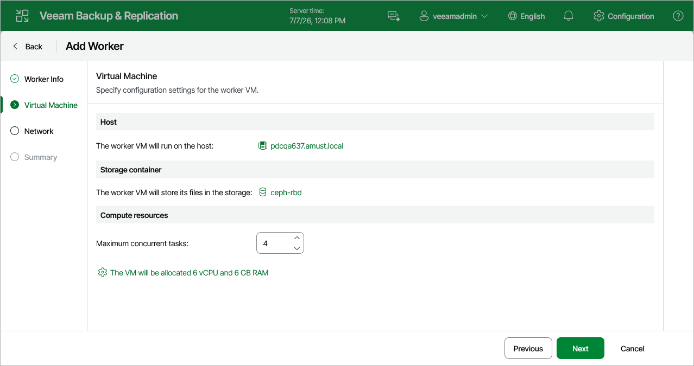

# Step 3. Configure Worker Settings

At the Virtual Machine step of the wizard, do the following:

1. Click the link in the Host field to specify a host where the worker will be launched.

Make sure that the default local storage is enabled on the selected host.

1. Click the link in the Storage field to select storage where system files of the worker will be stored. For storage to be displayed in the list of available storage, it must be configured in the virtual environment as described in [Proxmox VE documentation](https://pve.proxmox.com/wiki/Storage).

Make sure that the selected storage is file-level storage that supports snapshots.

1. In the Maximum concurrent tasks field, specify the number of tasks that the worker will be able to handle in parallel. If this value is exceeded, the worker will not start processing a new task until one of the currently running tasks finishes.

The default number of concurrent tasks is set to 4. When you change this value, the wizard automatically adjusts the amount of resources that will be allocated to the VM running as the worker. If you want to specify the amount of resources manually, click the link below the Maximum concurrent tasks field.

|  |
| --- |
| Note |
| When performing data protection and disaster recovery operations, Veeam Backup & Replication initiates a new task for each VM that is being processed. |

Page updated 2026-07-30

