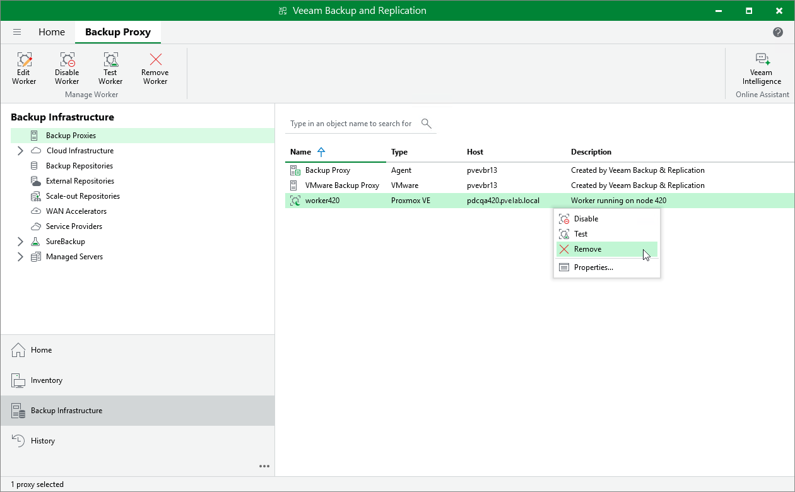

# Removing Workers

Veeam Backup & Replication allows you to permanently remove workers if you no longer need them. Note that you cannot remove a worker while it is transferring data for a backup or restore operation.

To remove a worker, do the following:

1. Open the Backup Infrastructure view.
2. In the inventory pane, select Backup Proxies.
3. In the working area, select the necessary worker and click Remove Worker on the ribbon.

Alternatively, right-click the worker and select Remove.

1. In the Veeam Backup & Replication window, confirm that you want to permanently delete the worker.

