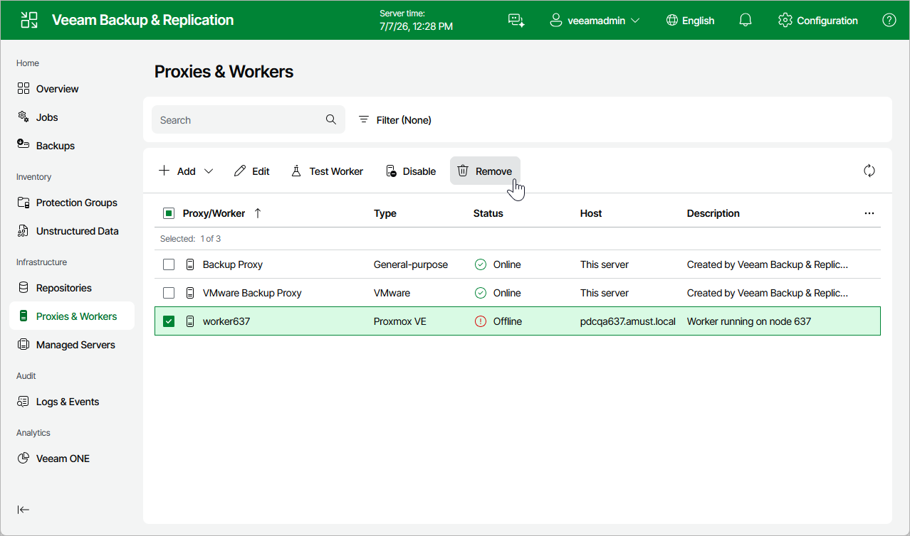

# Removing Workers

Veeam Backup & Replication allows you to permanently remove workers if you no longer need them. Note that you cannot remove a worker while it is transferring data for a backup or restore operation.

To remove a worker, do the following:

1. Navigate to Proxies & Workers.
2. Select the worker and click Remove.

Page updated 2026-07-15

