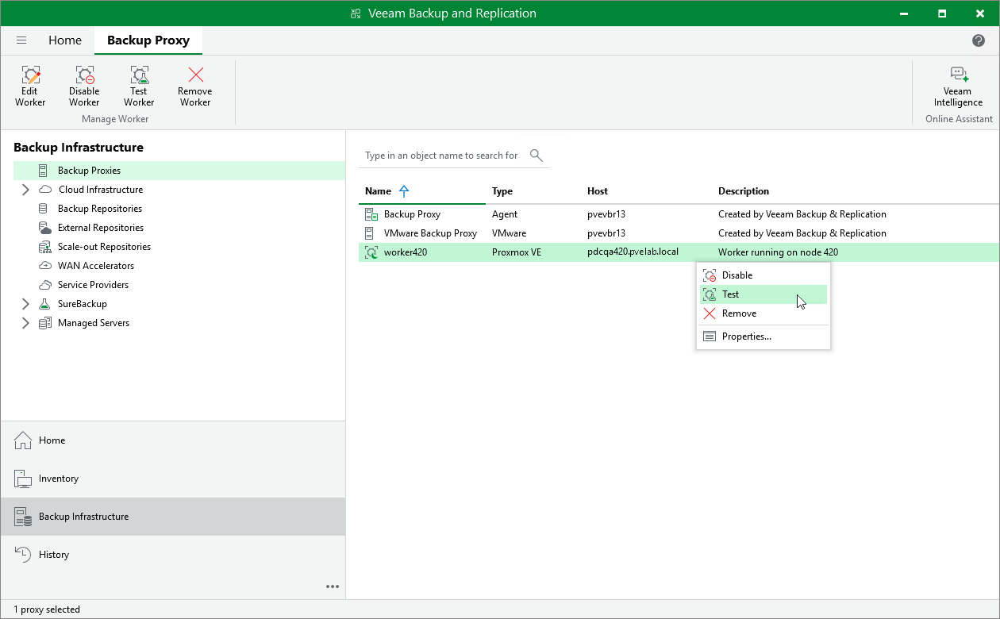

# Testing Workers

Before using a worker for a backup or restore operation, Veeam Backup & Replication automatically tests its configuration — verifies that the worker service can start successfully, checks that the worker can connect to the backup server and to the host, and installs available updates.

If you want to ensure that the worker configuration is correct before it is used for a backup or restore operation, you can start a worker configuration test manually:

1. Open the Backup Infrastructure view.
2. In the inventory pane, select Backup Proxies.
3. In the working area, select the necessary worker and click Test Worker on the ribbon.

Alternatively, right-click the worker and select Test.

|  |
| --- |
| Tip |
| As soon as Veeam Backup & Replication finishes the worker configuration test, the worker will be powered off. You can review details of the test session in system logs as described in section [Viewing History Statistics](history_statistics.md). |

