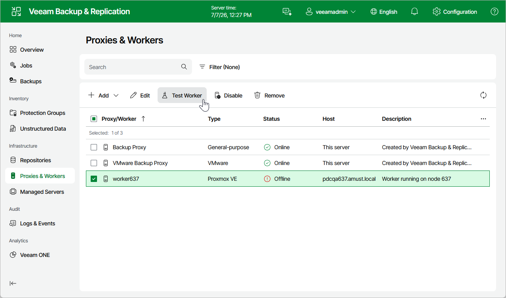

# Testing Workers

Before using a dedicated worker for a backup or restore operation, Veeam Backup & Replication automatically tests its configuration — verifies that the worker service can start successfully, checks that the worker can connect to the backup server and to the cluster, and installs available updates.

If you want to ensure that the worker configuration is correct before it is used for a backup or restore operation, you can start a worker configuration test manually:

1. Navigate to Proxies & Workers.
2. Select the worker and click Test Worker.

Note that you can select and test multiple workers at once.

As soon as Veeam Backup & Replication finishes the worker configuration test, the worker will be powered off.

Page updated 2026-07-15

