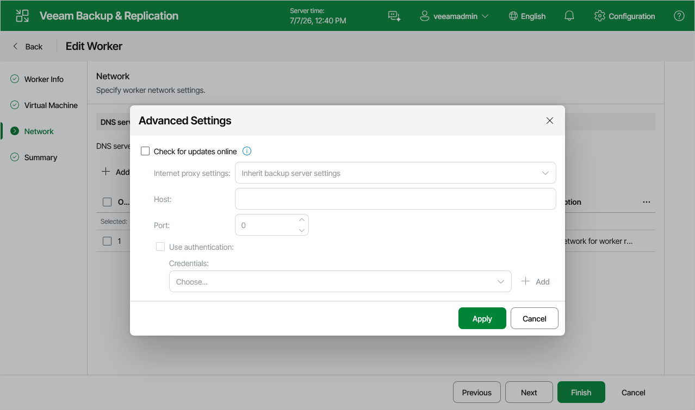

# Disabling Automatic Worker Updates

When launching a worker for a backup or restore operation, Veeam Backup & Replication automatically downloads updates from Veeam repositories and installs them on the worker. If the worker is not connected to the internet, you can instruct Veeam Backup & Replication to [use an internet proxy](pve_workers_add_network_web.md) that will provide access to the necessary resources.

If a worker does not have access to the internet and no internet proxy is configured for the worker, you can disable automatic updates to avoid connection failures and eliminate session warnings:

1. Navigate to Proxies & Workers.
2. Select the worker and click Edit.
3. At the Networks step of the Edit Worker wizard, click Advanced and clear the Check for updates online check box. Then, click Finish to save changes made to the worker settings.

Page updated 2026-07-27

