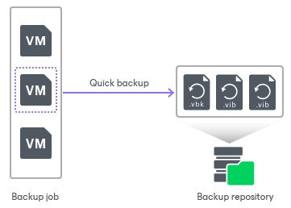

# Quick Backup

In this article

Quick backup lets you perform on-demand incremental backup for VMs. You can use quick backup if you want to produce an additional restore point for one or more VMs in a backup job and do not want to configure a new job or modify the existing one. Quick backup can be run for both incremental backup chains and reverse incremental backup chains (deprecated).

Quick backup is an incremental backup task: Veeam Backup & Replication copies only changed data for selected VMs and saves this data to a new restore point in the backup chain. Similar to incremental backup, quick backup can only be run for VMs that have been successfully backed up at least once and have a full restore point. If there is no full restore point for a VM, quick backup cannot be performed.

To perform a quick backup, Veeam Backup & Replication uses an existing backup job. When you start a quick backup task for a VM, Veeam Backup & Replication verifies that a backup job processing this VM exists on the backup server. If such a job is detected, Veeam Backup & Replication triggers a job and creates an incremental restore point for the VM. If a backup job for the VM does not exist, quick backup is terminated.

You can run a quick backup for one or multiple VMs simultaneously. If you start a quick backup for several VMs and these VMs are processed by different backup jobs, Veeam Backup & Replication triggers a set of backup jobs. Each triggered job creates a separate restore point and stores it in the correct backup chain.

In some cases, a VM may be processed by several backup jobs on the backup server. In this case, Veeam Backup & Replication starts the job that has created the most recent restore point for the VM.

For example, VM01 is processed by 2 jobs:

* Backup job 1 created the most recent restore point on Monday
* Backup job 2 created the most recent restore point on Tuesday

When you start a quick backup for VM01, Veeam Backup & Replication will trigger Backup job 2 to create a new incremental restore point.

|  |
| --- |
| Note |
| If the quick backup task overlaps the scheduled backup job, the backup job waits for the quick backup task to complete. |

Limitations for Quick Backup

You cannot perform a quick backup for VMware Cloud Director VMs processed with VMware Cloud Director jobs. However, if you process a VMware Cloud Director VM with a regular backup job, you can switch to the Computer view and start the quick backup operation for this VM.

Related Topics

* [Retention Policy for Quick Backups](quick_backup_retention.md)
* [Performing Quick Backup](performing_quick_backup.md)

Page updated 9/17/2025

Page content applies to build 13.0.1.1071
