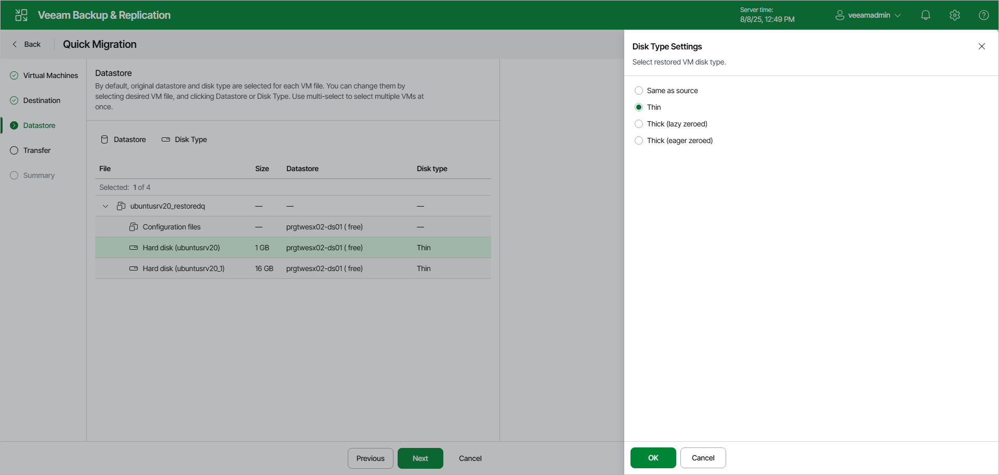

# Step 3. Specify Datastores and Disk Types

At the Datastore step, select target datastores and configure disk types:

1. To select a datastore for files, select the necessary files and click Datastore. In the Select Datastore window, select the necessary datastore and click OK to save the changes.

Veeam Backup & Replication displays only those datastores that are accessible by the selected ESXi host. If you have chosen to relocate VMs to a cluster, Veeam Backup & Replication will display only shared datastores.

|  |
| --- |
| Important |
| [For Instant Recovery finalization] If you migrate VMs to the same datastore cluster that is used as the destination for redirecting virtual disk updates (the [Datastore](instant_recovery_datastore_vm_web.md) step of the Instant Recovery to VMware wizard), you must enable the Force Veeam transport usage check box at the Transfer step of the Quick Migration wizard. Veeam Backup & Replication will use Veeam Quick Migration instead of Storage vMotion. This will help to prevent data loss due to a bug in VMware Storage vMotion. If you do not enable the Force Veeam transport usage check box, your relocated VM may be deleted. |

1. By default, Veeam Backup & Replication saves disks of relocated VMs in the thin format. To change disk format, select the necessary files and click Disk Type. In the Disk Type Settings window, choose the format that will be used to restore disk files: same as the source disk, thin or thick.

