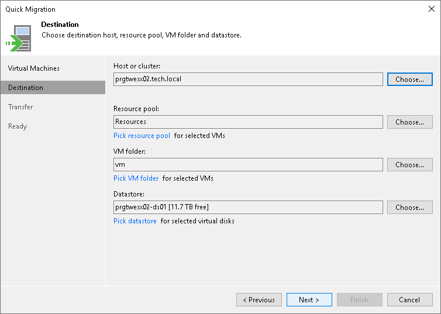

# Step 3. Specify VM Destination

At the Destination step of the wizard, select the destination to which the selected VMs must be relocated:

1. Click Choose next to the Host or cluster field and select an ESXi host or cluster where the relocated VM must be registered.
2. If all or majority of relocated VMs must belong to the same resource pool, click Choose next to the Resource pool field and select the target resource pool.

If you want to place relocated VMs to different resource pools:

1. Click the Pick resource pool for selected VMs link.
2. In the Choose Resource Pool window, click Add VM on the right and select the VMs.
3. Select the added VM in the VM resource pool list and click Resource Pool at the bottom of the window.
4. From the list of available resource pools, select the target resource pool.

1. If all or majority of relocated VMs must be placed to the same folder, click Choose and select the folder.

If you want to place relocated VMs to different folders:

1. Click the Pick VM folder for selected VMs link.
2. In the Choose Folder window, click Add VM on the right and select the VMs.
3. Select the added VM in the VM folder list and click VM Folder at the bottom of the window.
4. From the list of available folders, select the target folder.

The VM folder section is disabled if you selected a standalone ESXi host as a target for VM relocation.

1. If all or majority of relocated VMs must be stored on the same datastore, click Choose and select the datastore. Veeam Backup & Replication displays only those datastores that are accessible by the selected ESXi host. If you have chosen to relocate VMs to a cluster, Veeam Backup & Replication will display only shared datastores.

If you want to place relocated VMs to different datastores:

1. Click the Pick datastore for selected virtual disks link.
2. In the Choose VM Files Location window, click Add VM on the right and select the VM that must be placed on datastores.
3. Select the added VM in the Files location list and click Datastore at the bottom of the window.
4. From the list of available datastores, select the target datastore.

You can also place the configuration file and individual disk files of a VM to different datastores:

1. Add a VM to the Files location list, expand the VM and select the required files.
2. Click Datastore at the bottom of the window and choose the destination for the files.

1. By default, Veeam Backup & Replication saves disks of relocated VMs in the thin format. If necessary, you can change the disk format. For example, if the original VM uses thick disks, you can change the disk format of the relocated VM to thin provisioned and save on disk space required to store VM data.

Disk format change is available only for VMs using virtual hardware version 7 or later.

To change VM disk format:

1. Click the Pick datastore for selected virtual disks link.
2. In the Choose VM Files Location window, click Add VM on the right and select the VM whose disk format you want to change.
3. Select the added VM in the list and click Disk type at the bottom of the window.
4. In the Disk Type Settings section, choose the format that will be used to restore VM disk files: same as the source disk, thin or thick.

