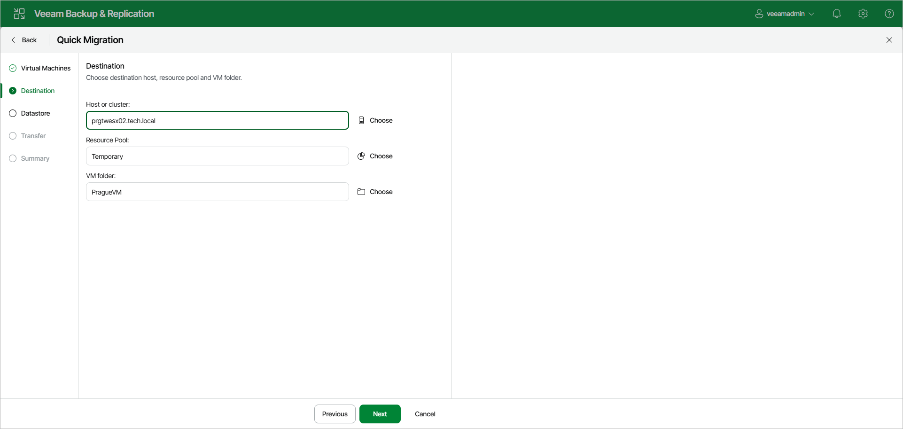

# Step 2. Specify Destination

At the Destination step of the wizard, select the destination to which the selected VMs must be relocated. Click Choose next to Host or cluster, Resource Pool and VM folder to choose the necessary resources.

