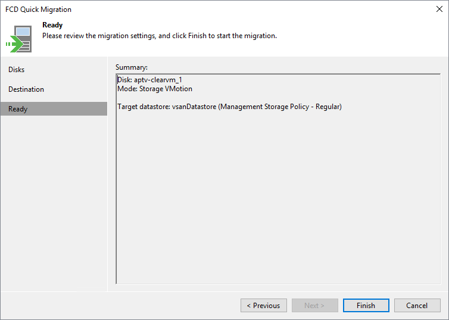

# Step 4. Finish Working with Wizard

In this article

At the Ready step of the wizard, review details on FCDs Quick Migration and click Finish to exit the wizard.

Page updated 5/15/2024

Page content applies to build 13.0.1.1071
