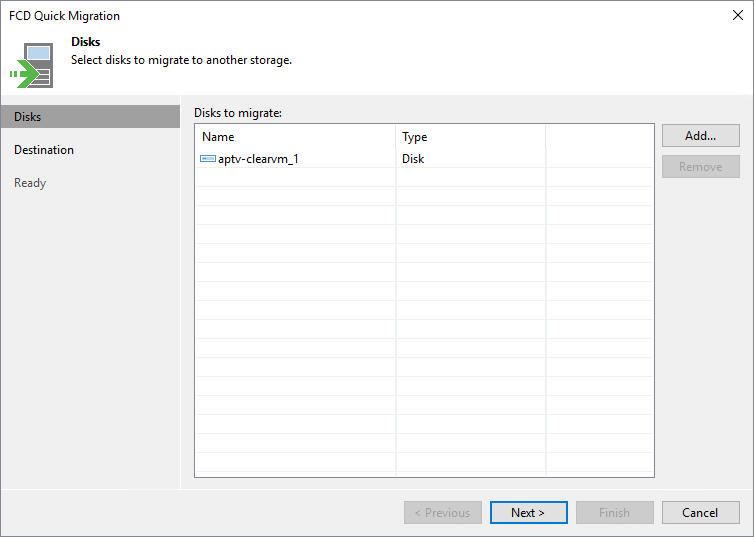

# Step 2. Select FCDs to Migrate

At the Disks step of the wizard, specify the FCDs that you want to migrate. To add FCDs, click Add and select necessary FCDs from the virtual environment. If you want to exclude specific FDCs from migration, select the necessary FCD and click Remove.

