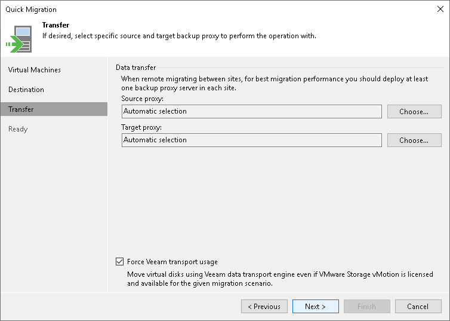

# Step 4. Select Infrastructure Components for Data Transfer

In this article

At the Transfer step of the wizard, assign infrastructure components to relocate the VMs:

1. In the Data transfer section, select backup proxies that must be used to transfer VM data from source to target.

If you plan to migrate VMs within one site, the same backup proxy can act as the source backup proxy and target backup proxy. For off-site migration, you must deploy at least one backup proxy in each site to establish a stable connection across the sites for data transfer.

Click Choose next to the Source proxy and Target proxy fields to select backup proxies for migration. In the Backup Proxy window, you can choose automatic proxy selection or assign proxies explicitly.

+ If you choose Automatic selection, Veeam Backup & Replication will detect backup proxies that have access to the source datastore and will automatically assign optimal proxy resources for processing VM data.

During migration, VMs are processed one by one. Before processing a new VM in the list, Veeam Backup & Replication checks available backup proxies. If more than one backup proxy is available, Veeam Backup & Replication analyzes transport modes that the backup proxies can use for data retrieval and the current VM on the backup proxies to select the most appropriate resource for VM processing.

+ If you choose Use the selected backup proxy servers only, you can explicitly select backup proxies that must be used to perform migration.

1. Select which migration mechanism to use: VMware vMotion or Veeam Quick Migration. Veeam Backup & Replication can use VMware vMotion only if your VMware license covers this functionality.

+ If you want to use VMware vMotion to relocate the VMs, leave the Force Veeam transport usage check box not selected. Veeam Backup & Replication will attempt to use the VMware vMotion mechanism to migrate the selected VMs. If VMware vMotion cannot be used for some reason (for example, if you do not have a VMware vSphere license for this functionality), Veeam Backup & Replication will fail over to its native migration mechanism.

+ If you do not want to use VMware vMotion, select the Force Veeam transport usage check box. Veeam Backup & Replication will use its native migration mechanism.

|  |
| --- |
| Important |
| If you use a native Veeam mechanism to relocate a VM, Veeam Backup & Replication suspends the initial VM on the source ESXi host (SmartSwitch) or powers off the initial VM (cold switch) for a short period of time during Quick Migration. |

Related Topics

[Quick Migration for VMware vSphere](quick_migration.md)

Page updated 12/10/2025

Page content applies to build 13.0.1.1071
