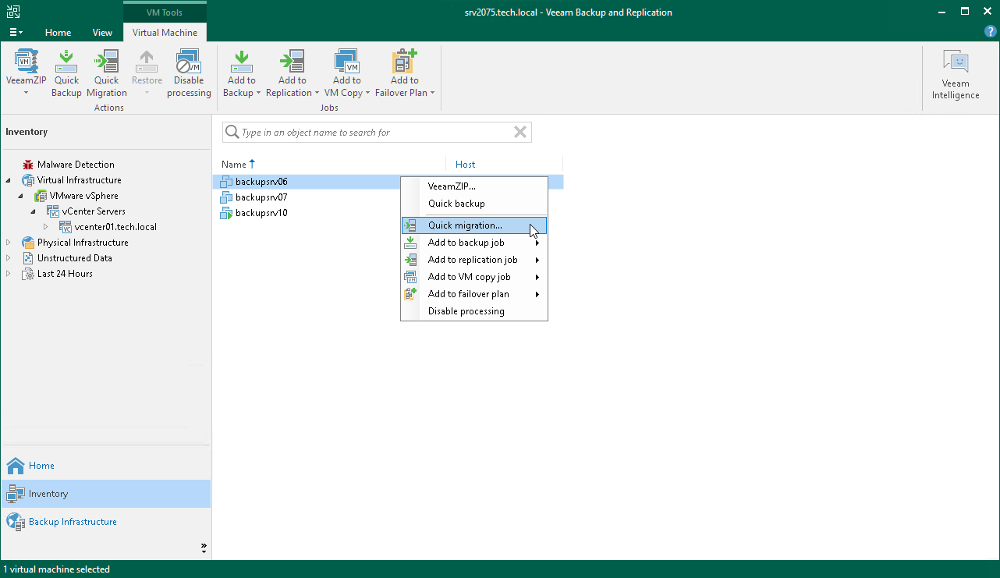

# Step 1. Launch Quick Migration Wizard

If you use Quick Migration as a way to finalize the Instant Recovery or Instant Disk Recovery processes, you must launch Quick Migration as described in sections [Finalizing Instant Recovery to VMware vSphere](instant_recovery_review_vm.md#migrate) and [Finalizing Instant Disk Recovery](instant_disk_recovery_finalize.md#migrate).

To launch Quick Migration as a self-contained capability:

1. Open the Inventory view.
2. In the infrastructure tree, select a host or VM container (host, cluster, folder, resource pool, VirtualApp, datastore or tag) in which the VMs that you want to relocate reside.
3. In the working area, select the VM and click Quick Migration on the ribbon or right-click the VMs and select Quick Migration.

