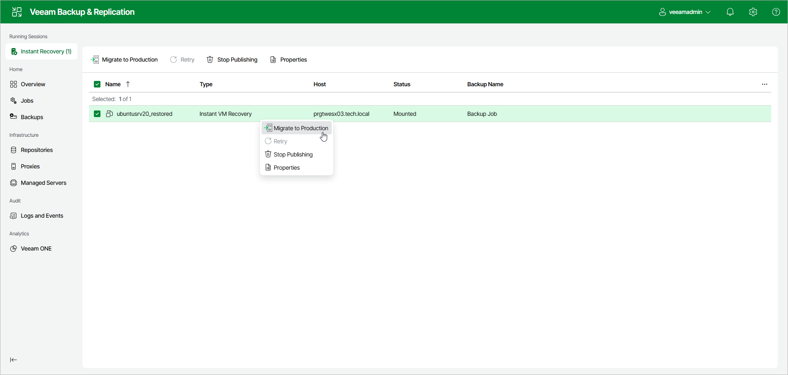

# Step 1. Launch Quick Migration Wizard

To finalize Instant Recovery and migrate a VM, click Instant Recovery in the management pane. Select the VM and click Migrate to Production. Alternatively, right-click the VM and select Migrate to Production.

At the Virtual Machines step of the wizard, check that you selected all the necessary VMs.

