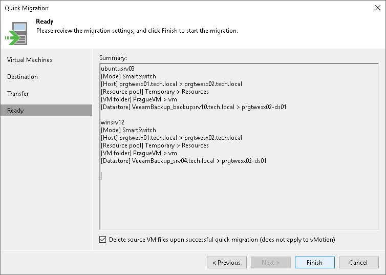

# Step 5. Finish Working with Wizard

At the Ready step of the wizard, your actions differ depending on the [method you have chosen to use for migration](quick_migration_infrastructure_hv.md). For more information on the methods, see [Quick Migration for Finalizing Instant Restore](quick_migration_hv.md).

If VMware vMotion is used for migration, review details and click Finish. When you migrate VMs to the same vCenter Server, the system preserves the MoRef IDs. When you migrate VMs to a different vCenter Server, the system assigns new MoRef IDs. However, all existing jobs that include the source VMs automatically switch to the VMs on the target host (target VMs). The backup chains continue, thus, the next job sessions for the VMs will be incremental.

If Veeam Quick Migration is used, you must decide whether to delete files of the source VMs (VMs for which the migration was launched) after Veeam Backup & Replication receives a heartbeat signal from the VMs on the target host (target VMs). In case of Veeam Quick Migration, the system assigns new MoRef IDs to the target VMs. How Veeam Backup & Replication handles jobs and backup chains for the source VMs depends on your choice:

* If you select the Delete source VM files upon successful migration check box, the system deletes the VMs for which the migration was launched, that is, the source VMs. For Instant Recovery, this refers to the VMs created during Instant Recovery, but before finalization. All backup jobs that included the source VMs automatically switch to the target VMs. The backup chains continue, and the next backup job session for the VMs is incremental.

* If you clear the Delete source VM files upon successful migration check box, the system does not delete the VMs for which the migration was launched, that is, the source VMs. For Instant Recovery, this refers to the VMs created during Instant Recovery, but before finalization. All backup jobs that included the source VMs continue to process them and maintain the existing backup chains. To protect the target VMs, you must add them to backup jobs manually.

During Veeam Quick Migration, Veeam Backup & Replication names the VMs according to the following patterns:

* Source VM: source\_VM\_name at the start of migration; source\_VM\_name\_migrated at the end of migration.

* Target VM: source\_VM\_name\_GUID at the start of migration; source\_VM\_name at the end of migration.

|  |
| --- |
| Note |
| The Delete source VM files upon successful migration option applies if the following conditions are met:   * VMware vMotion is not used.  * VMs are powered on before migration. * VMware Tools are installed on VMs. |

