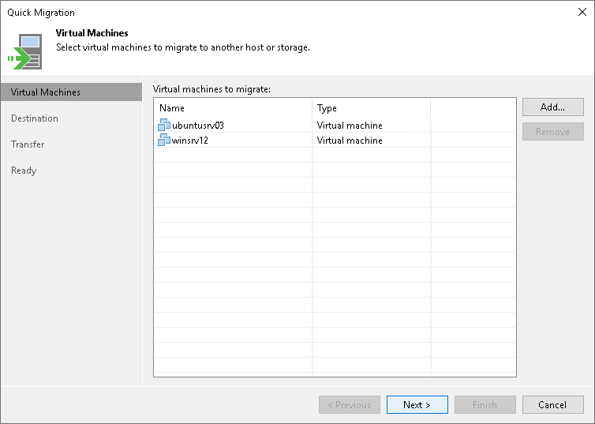

# Step 2. Select VMs to Relocate

At the Virtual Machines step of the wizard, select the VMs and VM containers that you want to relocate:

1. Click Add.
2. Use the toolbar at the top right corner of the window to switch between views: Hosts and Clusters, VMs and Templates, Datastores and VMs and Tags. Depending on the view you select, some objects may not be available. For example, if you select the VMs and Templates view, no resource pools, hosts or clusters will be displayed in the tree.
3. Select the necessary object and click Add.

To quickly find the necessary object, you can use the search field at the bottom of the Add Objects window.

1. Click the button to the left of the search field and select the necessary type of object to search for: Everything, Folder, Cluster, Host, Resource pool, VirtualApp or Virtual machine.
2. Enter the object name or a part of it in the search field.
3. Click the Start search button on the right or press [Enter] on the keyboard.

