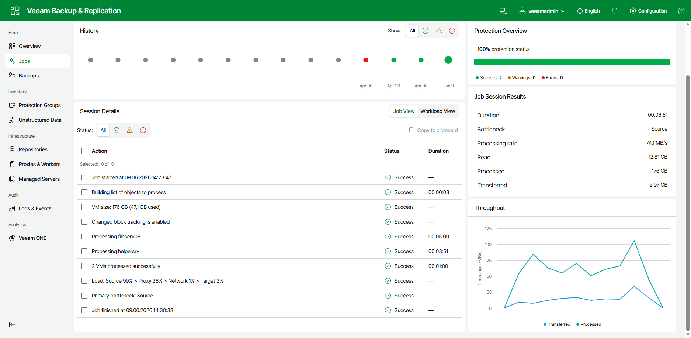

# Viewing Backup Job Details

You can view detailed information about a backup job, including its latest session results, processing statistics, and the list of processed objects.

To view backup job details, do either of the following:

* Select the Jobs node in the [management pane](vbr_web_console.md). In the working area, select the job and click Manage > Details on the ribbon or right-click the job and select Manage > Details.
* Select the Logs and Events in the management pane. In the working area, select the job and click its status in the Status column.

Backup Job Details

The Backup Job Details tab includes the following boxes:

* The History box shows a recent activity timeline of your backup job. Each dot represents a job run on the displayed date: a green dot indicates a successful run, an orange dot indicates a run that finished with a warning, and a red dot indicates a run that finished with an error. Use the Show filter to display all runs, or only those that finished with the success, warning, or error status. To view the results of a specific session, click the necessary session in the timeline. For more information, see [Viewing Job Session Results](session_results_hv_web.md).

* The Session Details box shows the list of actions performed during the job session. You can filter the list by the Status column and click Copy to clipboard to copy the session log.

* The Job View tab in the upper-right corner shows a list of operations performed during the job. To see the list of operations for the specific object included in the job, click the object in the pane on the left. To see the list of operations for the entire job, click anywhere on the blank area in the left pane.
* The Workload View tab in the upper-right corner shows a list of objects processed by the job.
* The Status column shows the result of each action. An action can be completed with the Success, Warning and Failed statuses.

* Success — the task is completed successfully.
* Warning — the task is completed with minor errors. Depending on the nature of the errors, the backup data may not be consistent.
* Failed — the task is not completed due to a blocking error.

* The Protection Overview box indicates the percentage of protected workloads in the last job run and shows how many workloads finished with the Success, Warnings and Errors statuses.

* The Job Session Results box shows general information about the job:

* Duration — time from the job start till the current moment or job end.
* Bottleneck — a bottleneck in the data transmission process. To learn about job bottlenecks, see [Performance Bottlenecks](detecting_bottlenecks.md).
* Processing rate — average speed of VM data processing. This counter is a ratio between the amount of data that has actually been read and the time it took to process the data. Note that only the data transfer time is used for the calculation, and the job runtime is irrelevant.

* Read — the amount of data read from the datastore by the source-side [Veeam Data Mover](veeam_transport_service.md) prior to applying compression and deduplication. For incremental job runs, the value of this counter is typically lower than the value of the Processed counter. Veeam Backup & Replication reads only data blocks that have changed since the last job session, processes and copies these data blocks to the target.
* Processed — total size of all VM disks processed by the job.
* Transferred — the amount of data transferred from the source-side Veeam Data Mover to the target-side Veeam Data Mover after applying compression and deduplication. This counter does not directly indicate the size of the resulting files. Depending on the backup infrastructure and job settings, Veeam Backup & Replication can perform additional activities with data: deduplicate data, decompress data prior to writing the file to disk, and so on. The activities can impact the size of the resulting file.

Colored Graph

To visualize the backup job progress, Veeam Backup & Replication displays a colored graph in the Throughput box:

* The light blue Processed line defines the amount of processed data.
* The dark blue Transferred line defines the amount of data transferred from the source-side Veeam Data Mover to the target-side Veeam Data Mover.

If the job session is still being performed, you can click the graph to view the data rate for the last 5 minutes or the whole processing period. If the job session has already ended, the graph displays information for the whole processing period only.

The colored graph is displayed only for the currently running job session or the latest job session. If you open backup job details for sessions other than the latest one, the colored graph will not be displayed.

Page updated 2026-07-21

