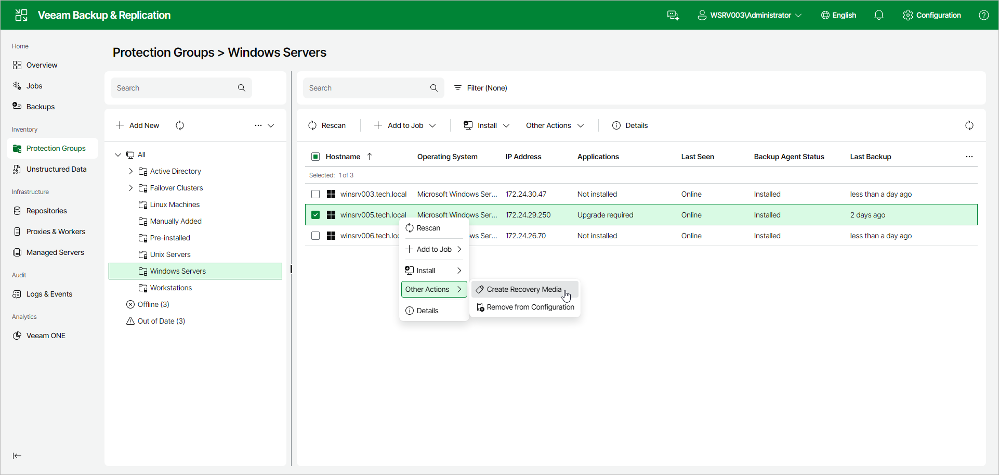
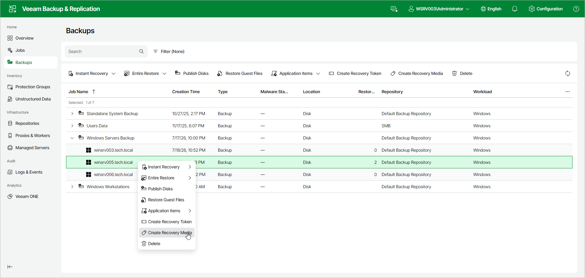

# Creating Veeam Recovery Media Using Web UI

In the Veeam Backup & Replication web UI, you can create Veeam Recovery Media for a Veeam Agent for Microsoft Windows computer in one of the following ways:

* From a protection group — create Veeam Recovery Media for a Microsoft Windows computer that is included in a protection group.
* From a backup — create Veeam Recovery Media for a Microsoft Windows computer whose Veeam Agent for Microsoft Windows backup is stored on a Veeam backup repository.

To create Veeam Recovery Media for a Microsoft Windows computer that is included in a protection group:

1. In the management pane, click Protection Groups.
2. Select the protection group that includes the necessary computer.
3. Select the check box next to the computer and, from the Other Actions drop-down list on the toolbar, select Create Recovery Media. Alternatively, right-click the computer and select Other Actions > Create Recovery Media.
4. In the Download Recovery Media Image window, do the following and click OK:

* To prepare the recovery media for [remote bare metal recovery](integration_instant_restore_media_remote.md), select the Allow remote start from this backup server when this recovery media is booted check box. Veeam Backup & Replication will be able to connect to the recovery environment booted from the resulting ISO and drive the restore remotely.
* To prepare a recovery media for local bare metal recovery only, clear the check box.

To create Veeam Recovery Media based on an existing Veeam Agent for Microsoft Windows backup:

1. In the management pane, click Backups.
2. Expand the necessary Veeam Agent backup and select the check box next to the computer for which you want to create Veeam Recovery Media.
3. Click Create Recovery Media on the toolbar. Alternatively, right-click the computer and select Create Recovery Media.
4. In the Download Recovery Media Image window, optionally select the Allow remote start from this backup server when this recovery media is booted check box to enable [remote bare metal recovery](integration_instant_restore_media_remote.md) and click OK.

Page updated 2026-07-21

