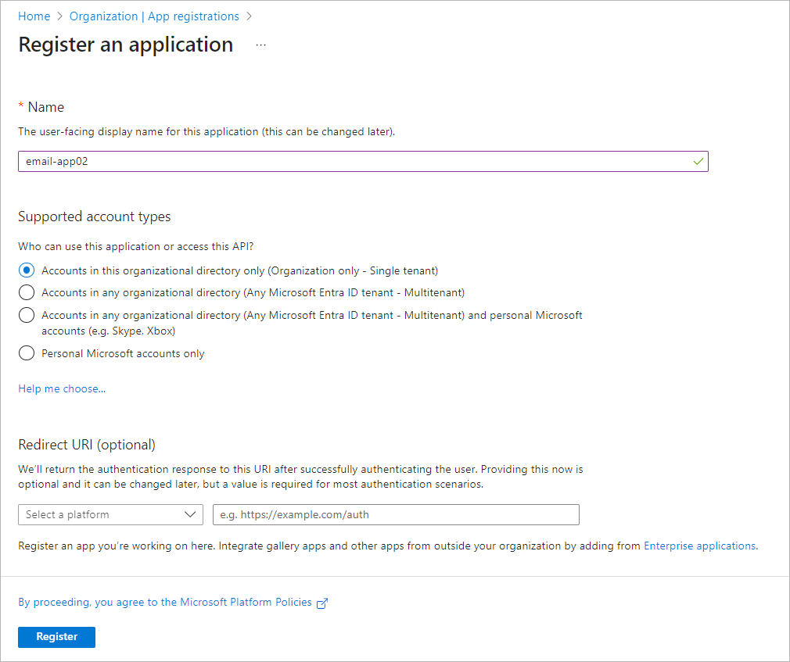
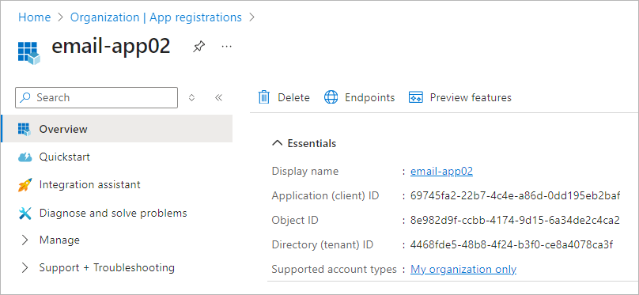
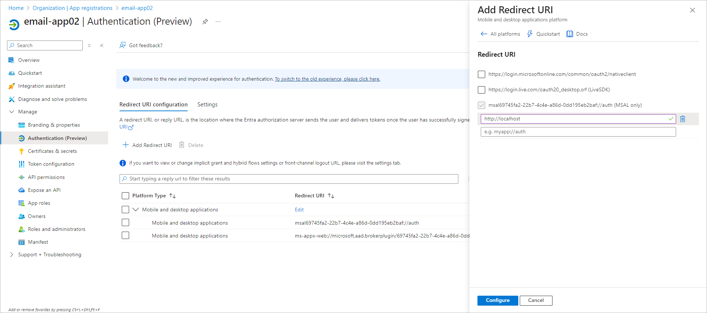
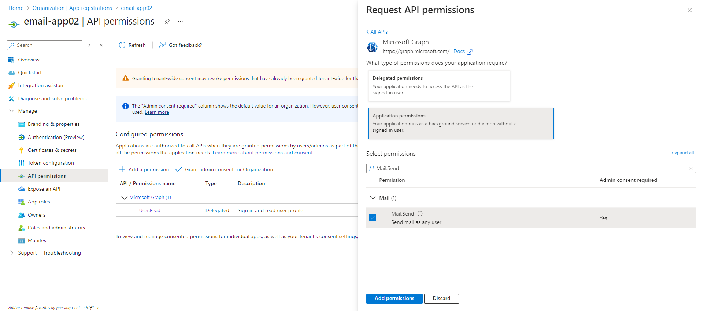
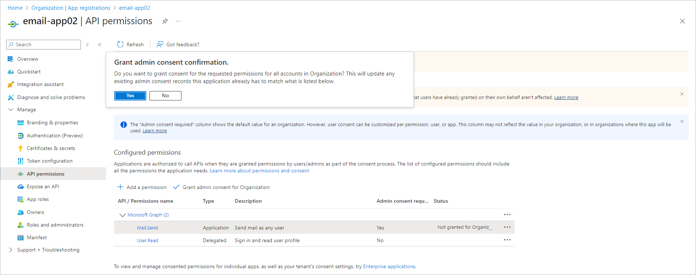

# Registering Application in Microsoft Azure Portal

If you want to use your own web application for email notifications, you need to configure it in the Microsoft Azure portal. To do this, perform the following steps:

1. Log in to the [Microsoft Azure portal](https://portal.azure.com/) under Exchange Online credentials that has permissions to register Entra ID applications.
2. In the portal menu, select Microsoft Entra ID.
3. Register the application:

1. In the Manage > App registrations section, click New registration.
2. In the Name field, specify the name of your application.
3. In the Supported account types section, select the Accounts in this organizational directory only option.
4. Click Register.

After registration, you can find application (client) ID and directory (tenant) ID in the Overview section of you application properties.

1. Add a platform configuration for your application:

1. In the Manage > Authentication > Redirect URI configuration section, click Add Redirect URI:
2. Select Mobile and desktop applications.
3. Specify the following redirect URIs:

* MSAL redirect URI msalAPP\_GUID://auth where APP\_GUID is the Application (client) ID
* ms-appx-web://microsoft.aad.brokerplugin/APP\_GUID where APP\_GUID is the Application (client) ID
* http://localhost

1. To add redirect URI, click Configure.

1. Allow Veeam Backup & Replication to call the Microsoft Graph API for sending email notifications. To do this, grant the application the Mail.Send permission:

1. In the Manage > API permissions section, click Add a permission.
2. Select Microsoft Graph > Application Permissions.
3. Select the Mail.Send permission from the list and click Add permissions.

1. Click Grant admin consent for <Organization> and confirm the operation.

After you finish the registration, specify custom application registration settings when configuring the mail server for Microsoft 365 OAuth 2.0 authentication. For more information, see [Configuring Mail Server](general_email_notifications.md#configuring_mail_server).

