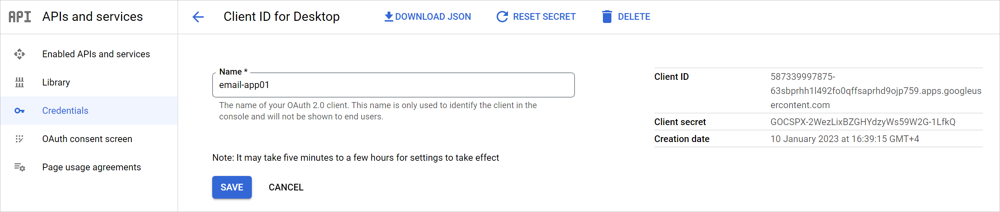
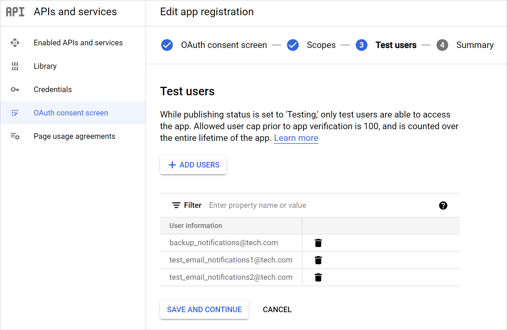

# Registering Application in Google Cloud Console

In this article

If you want to use your own web application for email notifications, you need to configure it in the Google Cloud console. To do this, perform the following steps:

1. Log in to the [Google Cloud console](https://console.cloud.google.com/) under a Google account that has permissions to create applications.
2. Create a new project and enable Gmail API for the project. To do this, open APIs and services > Library > Gmail API > Manage and click Enable API.
3. Create OAuth credentials. To do this, perform the following steps:

1. Open APIs and services > Credentials. Click Create credentials and select OAuth client ID.
2. In the Application type field, select Desktop app.
3. In the Name field, specify the name of your OAuth 2.0 client.
4. Click Create to generate the application client ID and the client secret. In the opened window, you can copy credentials or download them in the JSON format. You can also find them later in the APIs and services > Credentials section when editing your OAuth 2.0 client ID.

1. Open APIs and services > OAuth consent screen and click Edit App. Specify your application name and the user support email and click Save and continue.

1. If your application is in the Testing status, you must specify test users. To do this, at the Test users step of the Edit App wizard, click Add users. To apply changes, click Save and continue. Note that only test users will have access to the app.

After you finish the registration, specify custom application registration settings when configuring the mail server for Google Gmail OAuth 2.0 authentication. For more information, see [Configuring Mail Server](general_email_notifications.md#configuring_mail_server).

|  |
| --- |
| Note |
| You can leave your application in the Testing status and do not publish it. In that case, you will receive a warning message Google hasn't verified this app when connecting to your application. If you want to verify it, see [this Google article](https://support.google.com/cloud/answer/7454865?hl=en&ref_topic=3473162). |

Page updated 3/20/2025

Page content applies to build 13.0.1.1071
