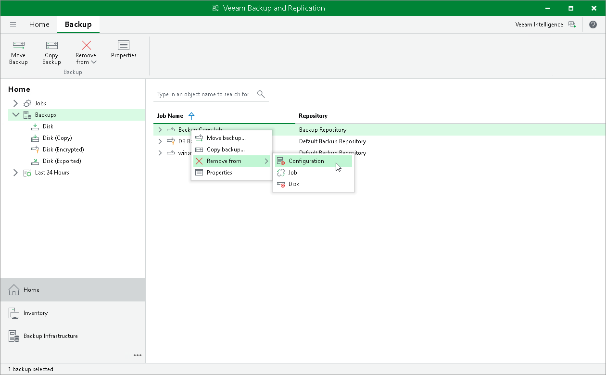

# Removing Backups from Configuration

If you want to remove records about backups from the Veeam Backup & Replication console and configuration database, you can use the Remove from configuration operation.

When you remove a backup from the configuration, backup files remain in the backup repository. You can import the backup to Veeam Backup & Replication at any time later and restore data from it.

When you remove an encrypted backup from the configuration, Veeam Backup & Replication removes encryption keys from the configuration database. If you import such a backup on the same backup server or another backup server, you will have to specify the password or unlock the backup with Veeam Backup Enterprise Manager. For more information, see [Importing Encrypted Backups](import_encrypted.md).

To remove a backup from the configuration:

1. Open the Home view.
2. In the inventory pane, select the Backups node.
3. In the working area, select the backup you want to remove, press and hold the [Ctrl] key, right-click the backup and select Remove from > Configuration.

|  |
| --- |
| Important |
| Removing backups from configuration is designed for experienced users only. Consider using [Deleting Backups from Disk](delete_backup_from_disk.md) or [Detaching Backups from Jobs](detach_backup.md) operations.  Create an [encrypted configuration backup](config_backup_encrypted.md) before removing backups from the configuration. |

