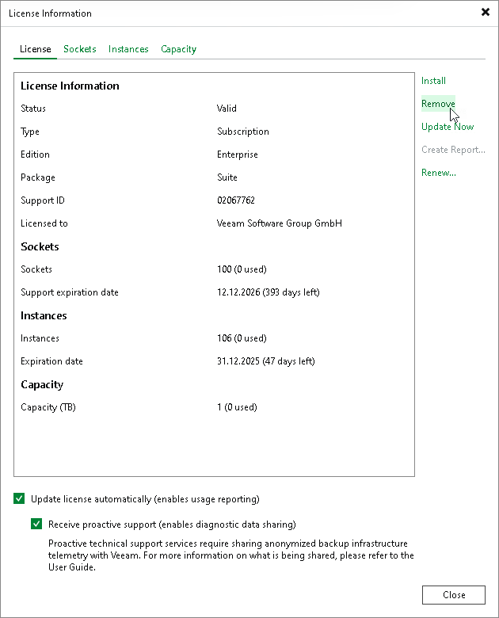
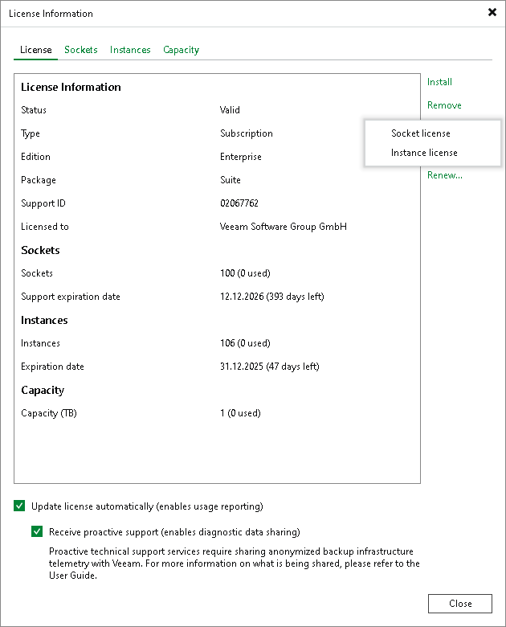

# Removing License Using Console

You can remove the installed license using the Veeam Backup & Replication console. When you remove a license, Veeam Backup & Replication will switch to the Veeam Backup & Replication Community Edition. For more information, see [Veeam Backup & Replication Community Edition](https://www.veeam.com/virtual-machine-backup-solution-free.html).

You can also remove a part of merged license. If you do so, Veeam Backup & Replication will operate under the other part of the merged license. For more information, see [Merging Licenses](license_merge.md).

To remove a Promo license, remove the license on top of which it was installed.

To remove a license, do the following:

1. From the main menu, select License.

1. In the License Information window, click Remove.

If you have both socket and instance licenses, you will be asked which license you want to remove.

1. Click Yes to confirm the license removal.

