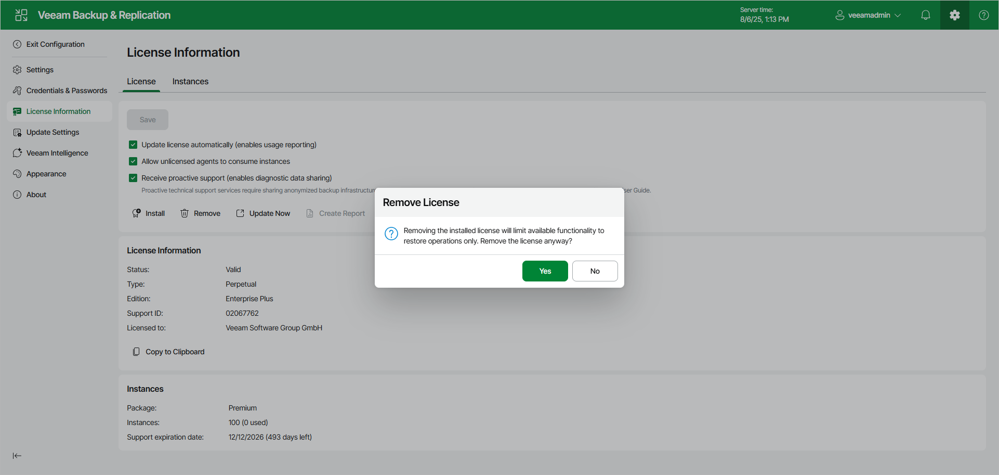

# Removing License Using Web UI

In this article

You can remove the installed license using the Veeam Backup & Replication web UI. When you remove a license, Veeam Backup & Replication will switch to the Veeam Backup & Replication Community Edition. For more information, see [Veeam Backup & Replication Community Edition](https://www.veeam.com/virtual-machine-backup-solution-free.html).

You can also remove a part of merged license. If you do so, Veeam Backup & Replication will operate under the other part of the merged license. For more information, see [Merging Licenses](license_merge.md).

To remove a Promo license, remove the license on top of which it was installed.

To remove a license, do the following:

1. Click the gear icon in the top bar and select License Information.
2. In the License Information window, click Remove.

1. In the Remove License window, click Yes to confirm the license removal.

Page updated 11/14/2025

Page content applies to build 13.0.1.1071
