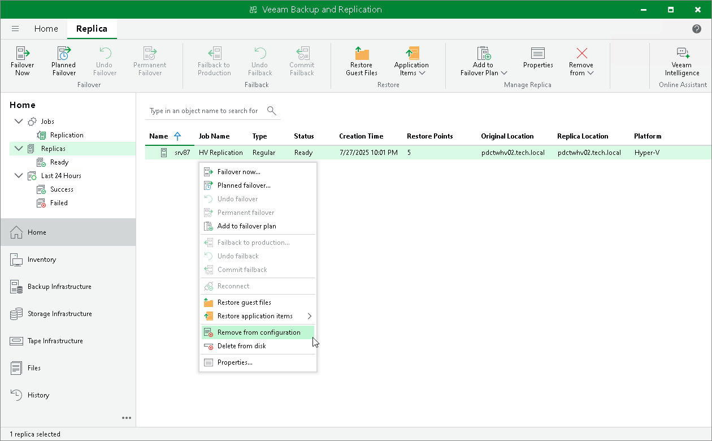

# Removing Replicas from Configuration

When you remove replicas from the configuration, Veeam Backup & Replication removes records about the replicas from the configuration database, stops showing the replicas in Veeam Backup & Replication console and also stops synchronizing their state with the state of the source VMs. However, the actual replicas remain on hosts.

To remove records about replicas from the Veeam Backup & Replication console and configuration database:

1. Open the Home view.
2. In the [inventory pane](vbr_ui.md), click the Replicas node.
3. In the working area, select replicas in the Ready state and click Remove from > Configuration on the ribbon. Alternatively, right-click one of the selected replicas and select Remove from configuration.

|  |
| --- |
| Note |
| Consider the following:   * The Remove from configuration operation can be performed only for VM replicas in the Ready state. If the VM replica is in the Failover or Failback state, this option is disabled. * When you perform the Remove from configuration operation for a VM that is replicated as a standalone object, Veeam Backup & Replication removes this VM from the initial replication job. When you perform the Remove from configuration operation for a VM that is replicated as part of a VM container (Hyper-V host, cluster, SCVMM, SCVMM tag, SCVMM host group, VM group, or volume), Veeam Backup & Replication adds this VM to the list of exclusions in the initial replication job. For more information, see [Exclude Objects from Replication Job](replica_exclude_hv.md). |

