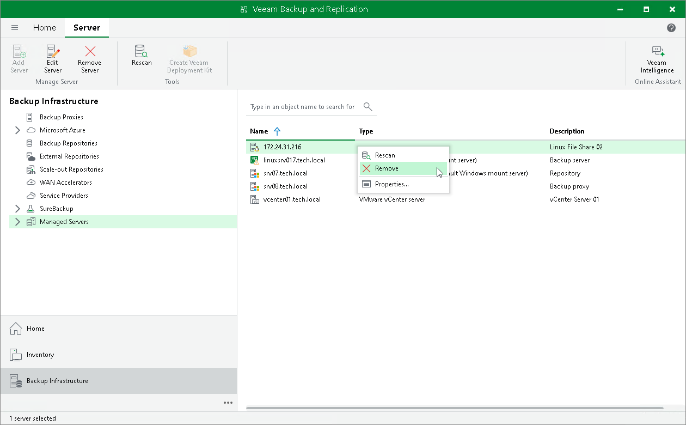

# Removing Servers

In this article

If you do not plan to use some server anymore, you can remove it from the backup infrastructure.

You cannot remove a server that has any dependencies. For example, you cannot remove a server that is referenced by a backup or replication job, performs the role of a VMware or off-host backup proxy or backup repository. To remove such server, you will need to delete all referencing jobs and roles first.

When you remove a server that is used as a target host or backup repository, backup files and replica files are not removed from disk. You can easily import these files later to Veeam Backup & Replication if needed.

|  |
| --- |
| Note |
| When you remove VMware Cloud Director from the backup infrastructure, vCenter Servers added to VMware Cloud Director are not removed. To remove the vCenter Server, in the inventory pane expand the vCenter Servers node, right-click the vCenter Server and select Remove.  You cannot remove vCenter Servers added to VMware Cloud Director until the VMware Cloud Director server is removed from the backup infrastructure. |

To remove a server from the backup infrastructure:

1. Open the Backup Infrastructure view.
2. In the inventory pane, select Managed servers.
3. In the working area, select the server and click Remove Server on the ribbon or right-click the server and select Remove.

Page updated 2/6/2025

Page content applies to build 13.0.1.1071
