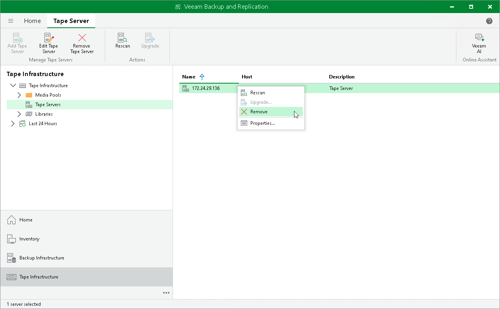

# Removing Tape Servers

In this article

To remove a tape server:

1. Open the Tape Infrastructure view.
2. Select the Servers node in the inventory pane.
3. Select the tape server in the working area and click Remove Tape Server on the ribbon. You can also right-click the necessary tape server in the working area and select Remove.

When you remove a tape server, Veeam Backup & Replication unassigns the tape server role from it, so it is no longer used as a tape server. The actual server remains connected to Veeam Backup & Replication.

Limitations for Removing Tape Servers

You cannot remove a tape server while tape jobs are running. Before you remove the tape server, stop all tape jobs.

Page updated 7/10/2023

Page content applies to build 13.0.1.1071
