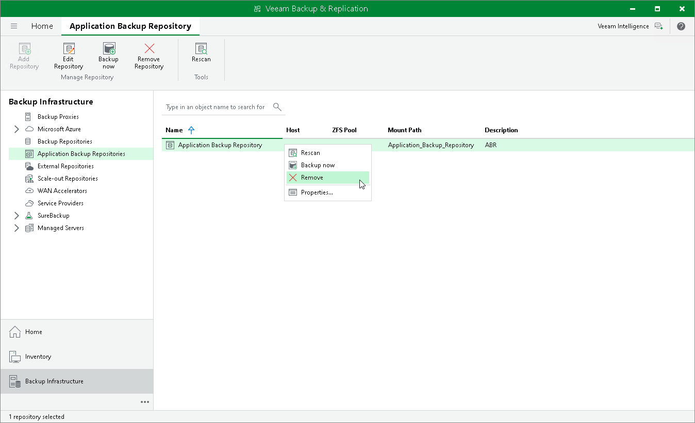
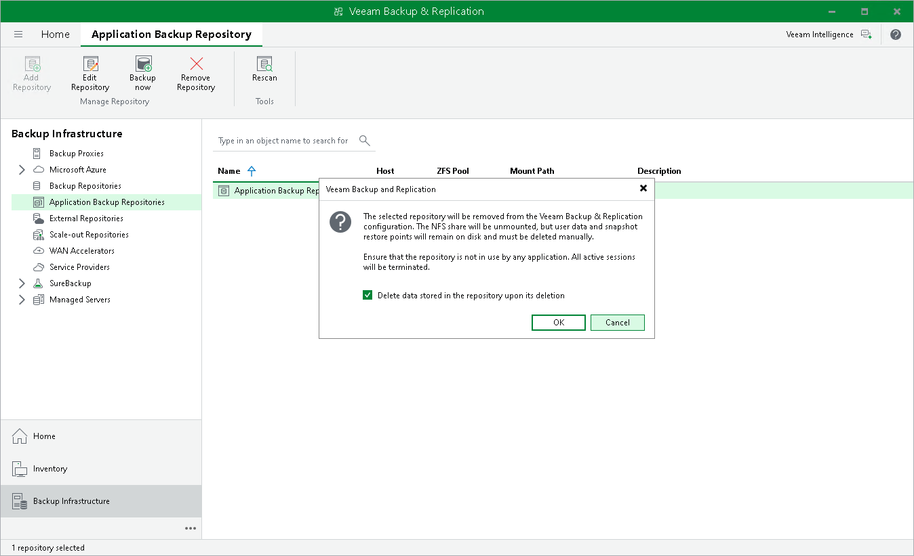
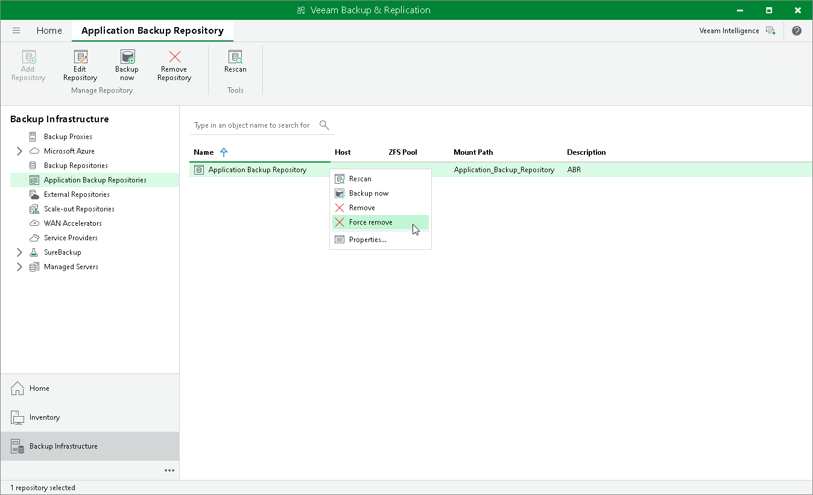

# Removing Application Backup Repositories

You can remove any application backup repository from the backup infrastructure if you no longer need it.

Considerations and Limitations

Before you remove an application backup repository, consider the following limitations:

* An application backup repository cannot be removed if an active Instant Recovery session is running for it. You must finalize the Instant Recovery session before you remove the application backup repository. For more information, see [Finalizing Instant Application Backup Repository Recovery](instant_abr_recovery_finalize.md).
* An application backup repository cannot be removed if it is added to a backup copy job as a source. For more information, see [Creating Backup Copy Jobs for Application Backup Repositories](create_bcj_abr.md).
* To remove an application backup repository, you must ensure that no applications are writing data to the repository at the moment of its removal. Once the removal process starts, all active writing sessions will be terminated.
* Veeam services and components do not get uninstalled when the application backup repository is removed from the backup infrastructure, as the Linux host remains added to Veeam Backup & Replication as a managed server.

Removing Application Backup Repository

To remove an application backup repository, do the following:

1. Open the Backup Infrastructure view.
2. In the inventory pane, select Application Backup Repositories.
3. In the working area, select an application backup repository and click Remove Repository on the ribbon or right-click an application backup repository and select Remove.

1. In the pop-up dialog window, confirm if you want to keep the application backup repository data upon deletion or not:

* To keep the user data and snapshot restore points on the volume, clear the Delete data stored in the repository upon its deletion check box. Veeam Backup & Replication will dismount the NFS share and remove the repository from the configuration database.

|  |
| --- |
| Note |
| If you add a new application backup repository with the same name and based on the same volume as the deleted one, Veeam Backup & Replication will rescan the volume and add the existing snapshots to the list of available restore points. |

* [For application backup repositories without any immutable restore points] Select the Delete data stored in the repository upon its deletion check box if you want to remove the entire dataset from the volume. Veeam Backup & Replication will unmount the NFS share, remove the repository from the configuration database and delete the user data.

Snapshots made immutable by the retention policy cannot be deleted. You can delete them manually once the immutability period is over.

Force Removing Application Backup Repository

If the application backup repository server is not available or does not respond, you can force remove it. In this case, the removal process happens in two stages:

1. Veeam Backup & Replication attempts to contact the application backup repository server and dismount the NFS share. If the application backup repository server responds, Veeam Backup & Replication dismounts the NFS share and removes the repository from the configuration database.
2. If the application backup repository server is not available, Veeam Backup & Replication removes it from the configuration database without deleting its data or dismounting the NFS share.

To force remove an application backup repository, do the following:

1. Open the Backup Infrastructure view.
2. In the inventory pane, select Application Backup Repositories.
3. In the working area, select an application backup repository, press and hold [Ctrl] key, right-click an application backup repository and select Force remove.

Page updated 2026-07-22

