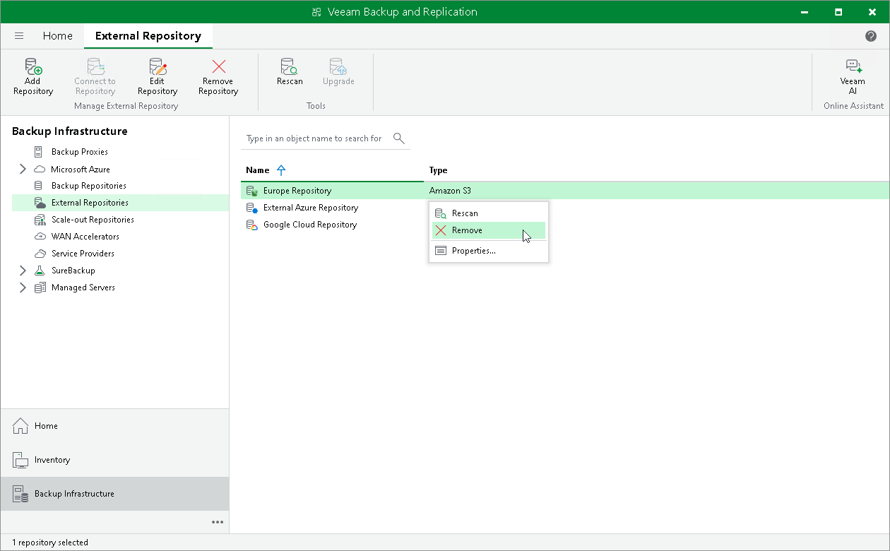

# Removing External Repositories

In this article

You can remove an external repository from the backup infrastructure.

When you remove an external repository, Veeam Backup & Replication does the following:

* Relinquishes ownership.
* Removes associated external repository records from the configuration database.
* Removes associated cache from the gateway server.

To remove an external repository:

1. Open the Backup Infrastructure view.
2. In the inventory pane, click External Repositories.
3. In the working area, select an external repository and click Remove Repository on the ribbon or right-click the external repository and select Remove.

Related Topics

* [Ownership](external_repository_ownership.md)
* [Cache](external_repository_cache.md)

Page updated 7/23/2024

Page content applies to build 13.0.1.1071
