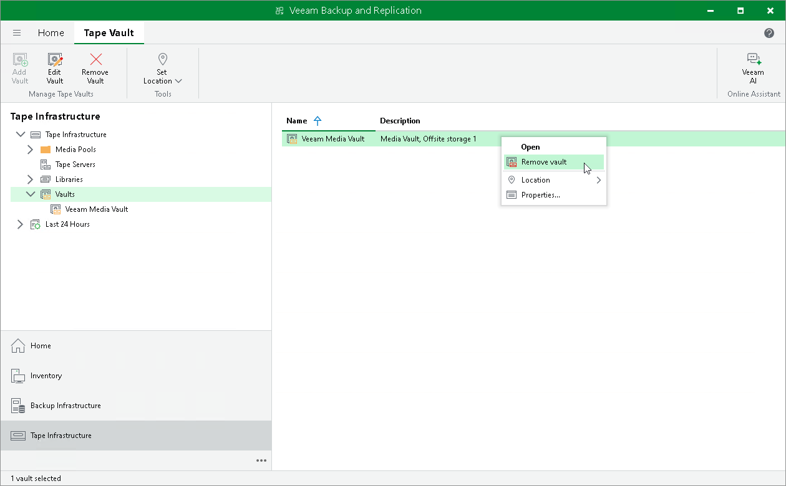

# Removing Vaults

In this article

If you no longer need a vault, you can remove it. Consider the following limitations:

* You cannot remove a vault that contains tapes. To be able to remove such vault, first move tapes from this vault to other vaults or remove them from the vault. When you remove a tape from the vault, you can see it in its media pool or under Media > Offline node.
* You cannot remove a vault that has a reference to any media pool. To be able to remove such vault, first edit settings of the media pool and remove a reference to this vault.

To remove a vault:

1. Open the Tape Infrastructure view.
2. Navigate to the Vaults node.
3. Select a vault and click Remove Vault on the ribbon. Alternatively, you can right-click the necessary vault in the working area and choose Remove Vault.
4. In the displayed dialog box, click OK to confirm deletion.

Page updated 7/10/2023

Page content applies to build 13.0.1.1071
