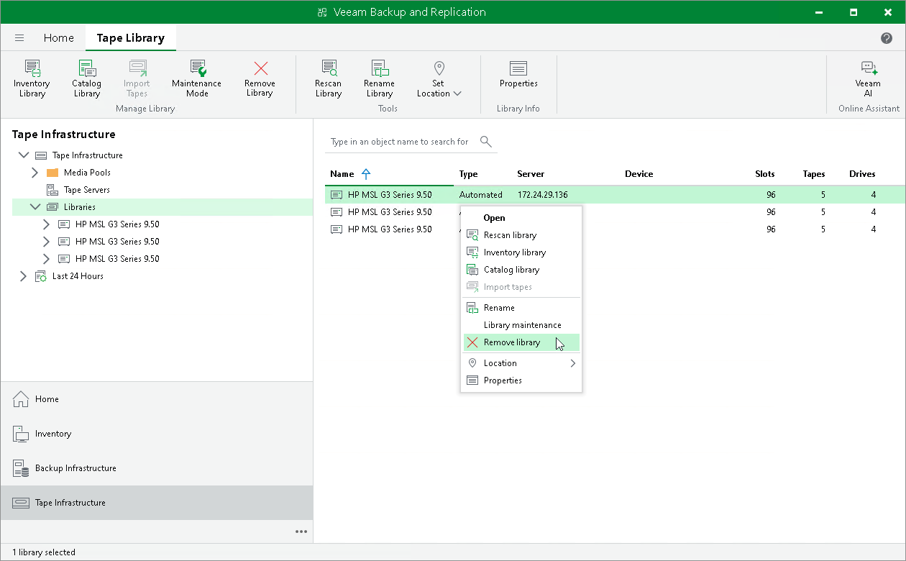

# Removing Tape Devices

If you want to stop using a tape library or standalone tape drive, you can remove it from your Veeam backup console.

Consider the following limitations:

* Only devices in the offline status can be removed. To remove a tape device, you need to physically disconnect it from the tape server first. Otherwise, the tape device will be discovered during the next rescan and reappear in the Libraries list. Alternatively, you can remove the tape server to which the tape device is connected.
* You cannot remove the tape device that is used in a media pool. Remove the device from all media pools first.

To remove a tape device:

1. Disconnect the tape device or the tape server.
2. Open the Tape Infrastructure view.
3. Select the Libraries node in the inventory pane.
4. Select a necessary item in the working area and click Remove Library on the ribbon. You can also right-click the necessary device in the working area and select Remove library.
5. In the displayed dialog box, click OK to confirm deletion.

|  |
| --- |
| Tip |
| If you remove the tape server, the tape devices remain connected to it. You can connect the tape server back to your console. In this case, Veeam Backup & Replication will recognize all tape devices that were previously added to it with tapes and media pools (in case they remain in the Veeam database).  You can also connect the tape server to another Veeam backup server. Veeam Backup & Replication will recognize the tape devices automatically, however you will need to create the media pools anew. |

