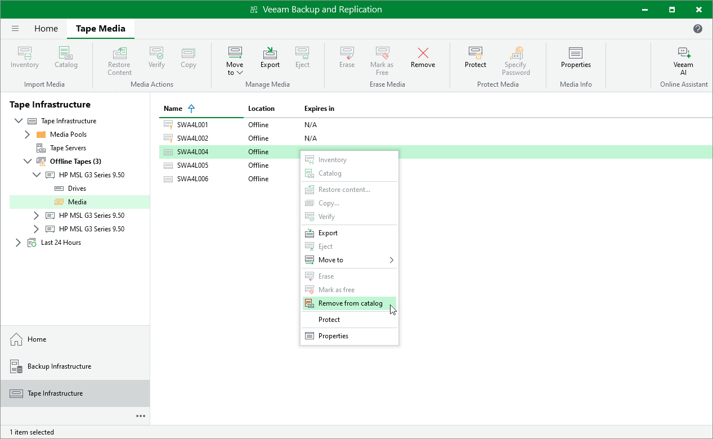

# Removing Tapes from Catalog

In this article

If you do not want to store information about a tape and contents on this tape in Veeam Backup & Replication database, you can remove the tape from the catalog. For example, you can perform removal from catalog if a physical tape no longer exists, and the tape should no longer be displayed among media in the Veeam Backup & Replication console.

You can remove only tapes that are offline.

To remove one or more tapes from the catalog:

1. Open the Tape Infrastructure view.
2. Navigate to the list of tapes either under Media Pools or under Libraries > LibraryName node > Media > Offline.
3. Select offline tapes you want to remove from the catalog and click Remove on the ribbon. Alternatively, you can right-click selected tapes and select Remove from catalog from the shortcut menu.
4. In the opened dialog box, click Yes to confirm removal.

|  |
| --- |
| Important |
| You cannot remove protected tapes from the catalog. To remove such tapes, you need to switch the protection off first. |

Page updated 6/14/2024

Page content applies to build 13.0.1.1071
