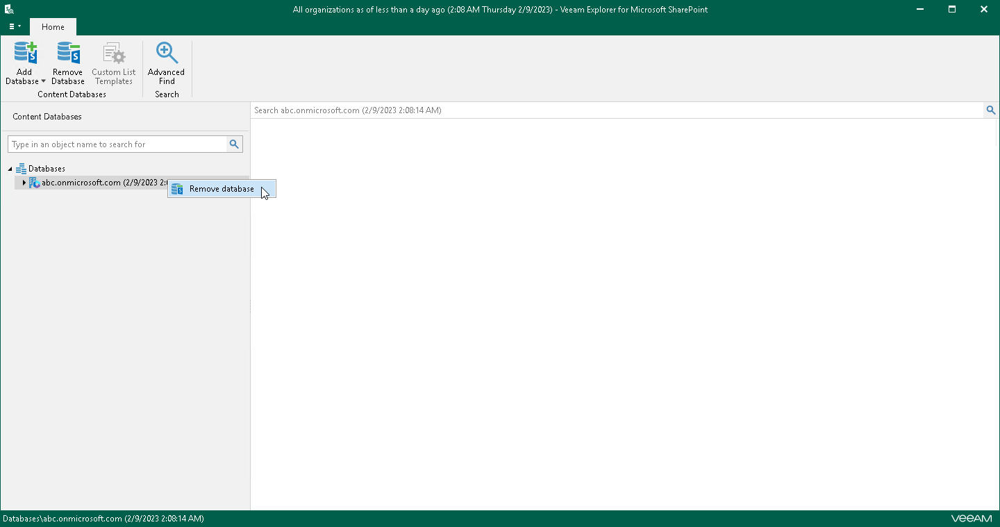

# Removing Databases

Veeam Explorer for Microsoft SharePoint allows you to remove Microsoft SharePoint databases from the application scope when you no longer need it.

To remove a database from the application scope, right-click a database in the navigation pane and select Remove database.

